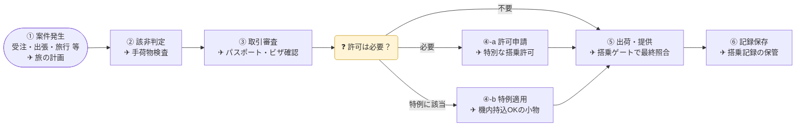



外為法・政省令・通達を「図・表・カード」でつかむ

<a class="btn btn-lg btn-light me-3 mb-3" href="docs/01-overview/">全体像から読む <i class="fa-solid fa-arrow-right ms-2"></i></a>
<a class="btn btn-lg btn-outline-light me-3 mb-3" href="docs/01-overview/#0-輸出できる早見マトリクス">輸出できる？早見表</a>
<a class="btn btn-lg btn-outline-light mb-3" href="docs/02-list-control/">リスト規制 1〜15項</a>


{}

## 輸出管理の流れ ✈ 空港の搭乗手続きにたとえると

| ステップ | ✈ たとえ | 実務では |
|---|---|---|
| ① 案件発生 | 旅の計画 | 受注・引合い、海外出張・旅行、外国人の受入れ、共同研究 等 |
| ② 該非判定 | 手荷物検査：持ち込めない物か | 貨物・技術がリスト規制（1〜15項）に当たるか |
| ③ 取引審査 | パスポート・ビザ確認：誰が・どこへ・何のため | 仕向地・需要者・用途（キャッチオール） |
| ④-a 許可申請 | 特別な搭乗許可 | 個別許可・包括許可 |
| ④-b 特例 | 機内持込OKの小物 | 少額・無償・携帯品 等 |
| ⑤ 出荷・提供 | 搭乗ゲートで最終照合 | 現品・書類・許可条件の照合 |
| ⑥ 記録保存 | 搭乗記録の保管 | 帳簿・判定書・審査記録 |

{}

{}

## 目的別に探す


{}
全体フロー・法体系・国グループを1ページで把握する。
[→ 01 全体像](docs/01-overview/)
{}
{}
1〜15項の対象としきい値の早見表。
[→ 02 リスト規制](docs/02-list-control/)
{}
{}
客観要件とインフォーム要件の判定フロー。
[→ 03 キャッチオール](docs/03-catch-all/)
{}



{}
役務取引・みなし輸出・特定類型。
[→ 04 役務取引](docs/04-technology-transfer/)
{}
{}
少額・無償・携帯品・公知技術など。
[→ 05 特例・例外](docs/05-exceptions/)
{}
{}
個別許可と包括許可の使い分け。
[→ 06 許可申請](docs/06-application/)
{}



{}
遵守基準・CP・帳簿保存。
[→ 07 社内体制](docs/07-compliance-cp/)
{}
{}
罰則・行政制裁と過去の事例。
[→ 08 違反事例](docs/08-penalties-cases/)
{}
{}
法律・政令・省令・通達と公式リンク。
[→ 09 関連法令](docs/09-laws/)
{}


{}



<i class="fa-solid fa-triangle-exclamation"></i> 本サイトの位置づけ

本サイトは学習・整理用の非公式資料です。規制対象・しきい値・国グループは<strong>政省令改正で頻繁に変わります</strong>。実際の判断は、必ず経済産業省「安全保障貿易管理」ページの最新の法令・通達・Q&amp;Aで確認してください。


