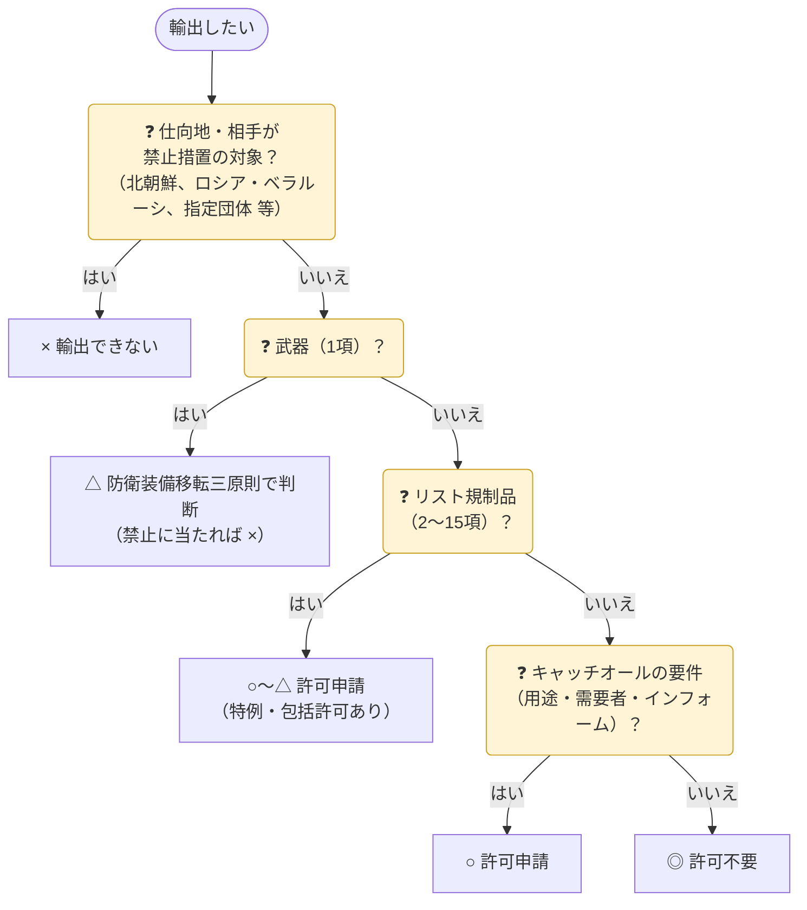
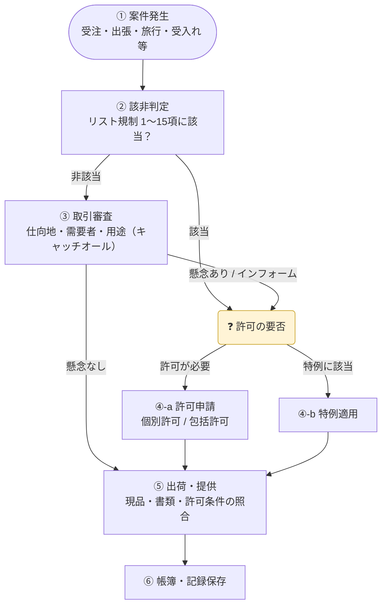
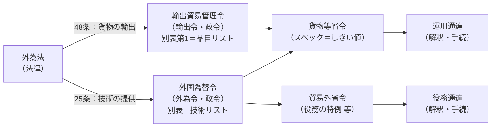

## 0. 輸出できる？早見マトリクス

「許可を取れば、どこへでも何でも輸出できるのか」への答えは **いいえ** です。品目と仕向地の組合せで、次の4パターンに分かれます。

| 記号 | 意味 |
|:-:|---|
| ◎ | **許可不要**（ただし該非判定・取引審査・記録は必要） |
| ○ | **許可が必要**。申請すれば許可され得る（包括許可を使える場合もある） |
| △ | 許可が必要で、**審査が厳しく、限定的**。不許可もあり得る |
| × | **輸出できない**。禁止措置・国連決議などにより、申請しても認められない |

| 品目 ＼ 仕向地 | グループA （米・英・独・韓 等） | 一般国 （中国・インド・タイ 等） | 国連武器禁輸国 （北朝鮮以外） | イラン | 北朝鮮 | ロシア・ ベラルーシ |
|---|:-:|:-:|:-:|:-:|:-:|:-:|
| **武器**（1項） | △ ※1 | △ ※1 | × ※2 | × ※2 | × | × |
| **リスト規制品**（2〜15項） | ○ | ○ | △ | △〜× ※3 | × | × ※4 |
| **リスト外の汎用品**（16項） | ◎ （インフォーム時は○） | ◎ （要件に当たれば○） ※5 | ◎ （要件に当たれば○） | ◎ （要件に当たれば○） | × | ◎〜× ※4 |
| **食料品・木材など**（16項の対象外） | ◎ | ◎ | ◎ | ◎ | × | ◎〜× ※4 |

<small>

- ※1 防衛装備移転三原則（2026年4月見直し）により、殺傷・破壊能力のある「武器」は**防衛装備品・技術移転協定の締結国**（17か国）に限り、個別に厳格審査。現に戦闘が行われている国へは原則不可。殺傷・破壊能力のない「非武器」は移転先の制約なし。
- ※2 三原則で「移転を禁止する場合」（条約・国連安保理決議の義務違反、紛争当事国への移転）に当たる。
- ※3 イランは懸念国（輸出令別表第4）。核・ミサイル関連（2項・4項など）は国連安保理決議で供給が禁止されており、許可は見込めない。
- ※4 ロシア・ベラルーシは**輸出禁止措置**（輸出令第2条の承認制）。リスト規制品のすべてに加え、半導体・工作機械・通信機器などの多くの汎用品、ぜいたく品が対象。さらに**指定された団体**向けは全ての貨物が禁止（第三国の指定団体も一部対象）。
- ※5 一般国向けの通常兵器キャッチオールは16項(1)特定品目のみ。

</small>

### 判断の順番

{}
- 大量破壊兵器等の開発等に使われる**おそれが明らか**な取引は、どの仕向地でも申請して許可されることはありません。
- 輸出禁止措置の対象（×）は、許可制ではなく**承認制**で、原則として承認されません（人道目的などの例外は個別に規定）。
- 禁止措置の範囲は頻繁に変わります。最新の範囲は経済産業省の「[ロシア等への輸出](https://www.meti.go.jp/policy/external_economy/trade_control/02_export/17_russia/russia.html)」「[対北朝鮮制裁関連](https://www.meti.go.jp/policy/external_economy/trade_control/01_seido/04_seisai/kitachosen.html)」で確認してください。
{}

{}
ダイヤモンド、ワシントン条約の動植物、核燃料物質、特定の有害廃棄物・化学物質、文化財なども、仕向地を問わず輸出に**承認**が必要です（輸出令別表第2）。本サイトの対象外です。
{}

## 1. 全体フロー

| ステップ | やること | 詳しく |
|---|---|---|
| ① 案件発生 | 輸出・技術提供に当たる行為がないかを把握（下表） | この下の表 |
| ② 該非判定 | 貨物・技術のスペックを1〜15項と照合 | [02 リスト規制](../02-list-control/) |
| ③ 取引審査 | 仕向地・需要者・用途の確認 | [03 キャッチオール](../03-catch-all/) |
| ④-a 許可申請 | 個別許可 or 包括許可 | [06 許可申請](../06-application/) |
| ④-b 特例 | 少額・無償・携帯品 等 | [05 特例・例外](../05-exceptions/) |
| ⑤ 出荷・提供 | 現品・技術と許可内容の一致を確認 | [07 社内体制](../07-compliance-cp/) |
| ⑥ 記録保存 | 帳簿・判定書・審査記録を保存 | [07 社内体制](../07-compliance-cp/) |

### ① 案件発生：こんな場面が入口になる

| 場面 | 規制の対象になり得るもの | 主な確認先 |
|---|---|---|
| 受注・引合い・見積り | 製品・部品・ソフトウェアの輸出 | ②該非判定 → ③取引審査 |
| 海外出張・旅行 | 持ち出すPC・スマホ内の技術データ、サンプル・測定器・工具 | ②該非判定、[05 特例（携帯品）](../05-exceptions/) |
| 海外での技術指導・据付・保守 | 現地で提供する技術（口頭・資料） | [04 役務取引](../04-technology-transfer/) |
| 外国人の採用・研修生・留学生の受入れ | 国内での技術提供（みなし輸出） | [04 役務取引](../04-technology-transfer/) |
| 共同研究・学会発表・論文 | 研究データ・未公開の技術 | [04 役務取引](../04-technology-transfer/)・[05 例外（公知・基礎研究）](../05-exceptions/) |
| 海外拠点・取引先とのデータ共有 | メール・クラウド・サーバーアクセスでの図面等の提供 | [04 役務取引](../04-technology-transfer/) |
| 修理品・返品・展示会出品物の送付 | 一時的な輸出・返送 | [05 特例（無償告示）](../05-exceptions/) |

{}
「**何を**（②）」と「**誰に・何のために**（③）」の2軸で判断します。②で非該当でも、③で懸念があれば許可が必要です。
{}

{}
「売るわけではない」出張・旅行・研修・データ共有も、**貨物の輸出や技術の提供**に当たり得ます。案件の入口を営業部門だけでなく、出張申請・採用・研究部門の手続にも組み込みます。
{}

## 2. 法体系（どこに何が書いてあるか）

| 階層 | 貨物 | 技術（役務） | 決めていること |
|---|---|---|---|
| 法律 | 外為法 48条 | 外為法 25条 | 許可制の根拠・罰則 |
| 政令 | 輸出令 別表第1 | 外為令 別表 | 規制の「項」（大分類） |
| 省令 | 貨物等省令 | 貨物等省令・貿易外省令 | 具体的スペック・特例 |
| 通達 | 運用通達 | 役務通達 | 用語解釈・手続・Q&A |

## 3. 規制の2本柱


{}
| 項目 | 内容 |
|---|---|
| 対象 | 輸出令別表第1 **1〜15項**（技術は外為令別表） |
| 判断基準 | 貨物・技術の**スペック** |
| 仕向地 | **全地域**（米国向けでも許可が必要） |
| 許可 | 該当すれば原則必要（特例・包括許可あり） |
{}
{}
| 項目 | 内容 |
|---|---|
| 対象 | **16項**：リスト外のほぼ全品目（食料・木材等を除く） |
| 判断基準 | **用途・需要者**（客観要件）＋ **インフォーム** |
| 仕向地 | 客観要件は**グループA以外**（インフォームはグループA向けも対象） |
| 許可 | 要件に当たる場合のみ必要 |
{}


## 4. 国グループ（仕向地の区分）

| グループ | 該当 | 主な影響 |
|---|---|---|
| **A** | 輸出令別表第3の国（輸出管理を厳格に行う27か国） | キャッチオールの客観要件は対象外（インフォームのみ）・一般包括許可の対象が広い |
| **B** | 国際輸出管理レジームに参加し一定要件を満たす国 | 一部の包括許可が使える |
| **C** | A・B・D以外 | 標準的な扱い |
| **D** | 別表第3の2（国連武器禁輸国・地域）・別表第4（懸念国） | 最も厳格。特例・包括の対象外が多い |

{}
アルゼンチン、オーストラリア、オーストリア、ベルギー、ブルガリア、カナダ、チェコ、デンマーク、フィンランド、フランス、ドイツ、ギリシャ、ハンガリー、アイルランド、イタリア、大韓民国、ルクセンブルク、オランダ、ニュージーランド、ノルウェー、ポーランド、ポルトガル、スペイン、スウェーデン、スイス、英国、米国（27か国）

※ 韓国は2019年に除外、2023年7月に再指定。最新は輸出令別表第3で確認。
{}

| 別表 | 国・地域 |
|---|---|
| 別表第3の2（国連武器禁輸） | アフガニスタン、中央アフリカ、コンゴ民主共和国、イラク、レバノン、リビア、北朝鮮、ソマリア、南スーダン、スーダン |
| 別表第4（懸念国） | イラン、イラク、北朝鮮 |

{}
ロシア・ベラルーシ向けなどの**輸出禁止措置**（外為法48条3項に基づく告示）は、リスト規制・キャッチオールとは**別枠**で確認が必要です。非該当品でも禁止対象になり得ます。
{}

## 5. 最低限の用語集

| 用語 | 意味 |
|---|---|
| 該非判定 | 貨物・技術がリスト規制に「該当／非該当」かを判定すること |
| 該非判定書（パラメータシート） | 判定結果と根拠スペックを記した書類。取引先から求められる |
| 居住者 / 非居住者 | 外為法上の区分。技術提供の規制は「非居住者」への提供が基本 |
| みなし輸出 | 国内での非居住者（や特定類型該当者）への技術提供を輸出と同様に管理 → [詳しく](../04-technology-transfer/#みなし輸出) |
| 需要者 / 最終需要者 | 貨物を実際に使う者（商社・代理店とは限らない） |
| 外国ユーザーリスト | 経産省が公表する、大量破壊兵器等・通常兵器の懸念が払拭されない外国の企業・組織のリスト（禁輸リストではない）→ [詳しく](../03-catch-all/#外国ユーザーリスト) |
| CP（Compliance Program） | 社内の輸出管理規程・体制 |
