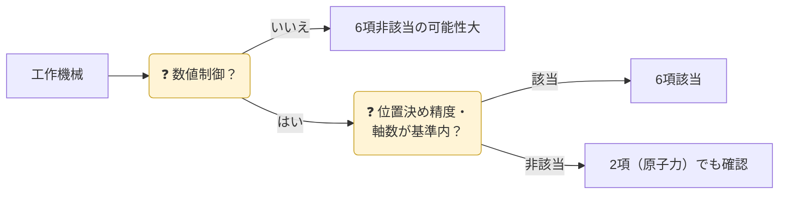

| 代表品目 | 着眼点（例） |
|---|---|
| 数値制御工作機械（旋盤・フライス盤・研削盤） | 同時輪郭制御の軸数、**片方向位置決め繰り返し精度**（例：0.9μm以下） |
| 放電加工機・ウォータージェット等 | 制御軸数・加工方式 |
| 三次元測定機 | 測定精度（最大許容誤差） |
| 軸受（ベアリング） | 精度等級・材質・使用温度 |
| ロボット | 防爆・耐放射線、特定用途向けの設計 |
| アイソスタティックプレス | 最大圧力・内径 |

{}
精度は**カタログ値ではなく規格（ISO 230-2 等）に基づく値**で判定します。オプション（リニアスケール等）を付けると該当になる機種もあります。
{}
