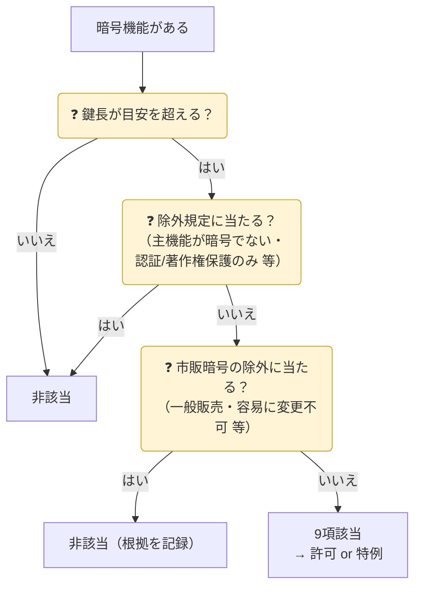


{}
| 代表品目 | 着眼点（例） |
|---|---|
| 無線通信装置 | 周波数ホッピング・スペクトル拡散・適応アンテナ |
| 通信傍受装置 | 移動体通信の傍受・妨害 |
| 光通信・交換装置 | 特定の性能・機能 |
{}
{}
| 暗号の種類 | 該当の目安（例） |
|---|---|
| 共通鍵（対称）暗号 | 鍵長 **56ビット超** |
| 公開鍵暗号（素因数分解型：RSA等） | 鍵長 **512ビット超** |
| 楕円曲線暗号 | 鍵長 **112ビット超** |

AES-128/256、RSA-2048 など**現在の標準的な暗号はほぼ全て目安を超える**ため、除外規定の確認が判定の中心になります。
{}


## 暗号品目の判定フロー

{}
- 暗号の用途が**認証・デジタル署名・データ完全性・著作権保護のみ**
- 主機能が暗号・通信・情報セキュリティでない製品（家電・医療機器 等）の組込暗号
- **一般に販売**され、利用者が暗号機能を容易に変更できない製品（いわゆる市販暗号）

具体的な要件は貨物等省令・運用通達で確認してください。
{}
