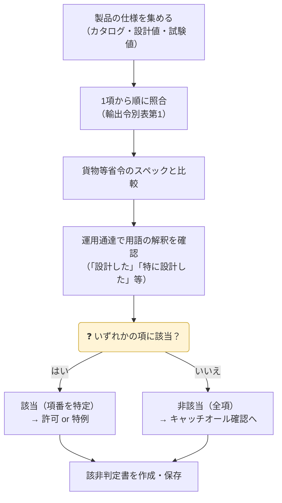

## 1〜15項 早見表

| 項 | 分野 | 主な国際レジーム | 典型例 | ページ |
|---|---|---|---|---|
| 1 | 武器 | WA（軍需品） | 銃砲・弾薬・軍用車両 | [1項](01-weapons/) |
| 2 | 原子力 | NSG | 核燃料物質・遠心分離機・一部の工作機械 | [2項](02-nuclear/) |
| 3 | 化学兵器 | AG / CWC | 化学剤原料・耐食性反応器 | [3項](03-chemical-weapons/) |
| 3の2 | 生物兵器 | AG / BWC | 病原体・発酵槽・噴霧乾燥器 | [3の2項](03-2-biological-weapons/) |
| 4 | ミサイル | MTCR | ロケット・無人航空機・推進薬 | [4項](04-missiles/) |
| 5 | 先端材料 | WA | 炭素繊維・特殊合金・フッ素樹脂製品 | [5項](05-advanced-materials/) |
| 6 | 材料加工 | WA | 工作機械・軸受・ロボット | [6項](06-materials-processing/) |
| 7 | エレクトロニクス | WA | 集積回路・半導体製造装置 | [7項](07-electronics/) |
| 8 | 電子計算機 | WA | 高性能コンピュータ | [8項](08-computers/) |
| 9 | 通信・情報セキュリティ | WA | 暗号装置・暗号ソフト | [9項](09-telecom-infosec/) |
| 10 | センサー・レーザー | WA | 赤外線カメラ・レーザー・ソナー | [10項](10-sensors-lasers/) |
| 11 | 航法装置 | WA | ジャイロ・慣性航法装置 | [11項](11-navigation-avionics/) |
| 12 | 海洋関連 | WA | 潜水艇・水中ロボット | [12項](12-marine/) |
| 13 | 推進装置 | WA | ガスタービンエンジン・人工衛星 | [13項](13-propulsion/) |
| 14 | その他 | WA（軍需品関連） | 火薬原料・粉末金属燃料 | [14項](14-others/) |
| 15 | 機微品目 | WA（超機微リスト） | 電波吸収材・水中探知装置 | [15項](15-sensitive/) |
| 16 | キャッチオール | ― | (1) 特定品目（工作機械・集積回路 等、HSコードで指定）／(2) それ以外のほぼ全品目 | [03 キャッチオール](../03-catch-all/) |

> WA＝ワッセナー・アレンジメント、NSG＝原子力供給国グループ、AG＝オーストラリア・グループ、MTCR＝ミサイル技術管理レジーム

## 該非判定の手順

{}
- **1項から15項まで全部**確認します。1つの製品が複数の項に該当することもあります（例：2項と6項）。
- 項目別対比表・パラメータシート（CISTEC 等が提供）を使うと抜け漏れを防げます。
- 判定根拠（スペック値・資料名・版数）を必ず記録します。
{}

{}
「メーカーの非該当証明があるから大丈夫」は危険です。**判定責任は輸出者にあります**。旧版の判定書を使い回したり、改正後の省令で再確認していなかったりする例が多く見られます。
{}

{}
各項ページの数値は**代表例**です。貨物等省令は毎年のように改正されます（国際レジームの合意を反映）。判定には必ず最新の省令・運用通達を使ってください。
{}
