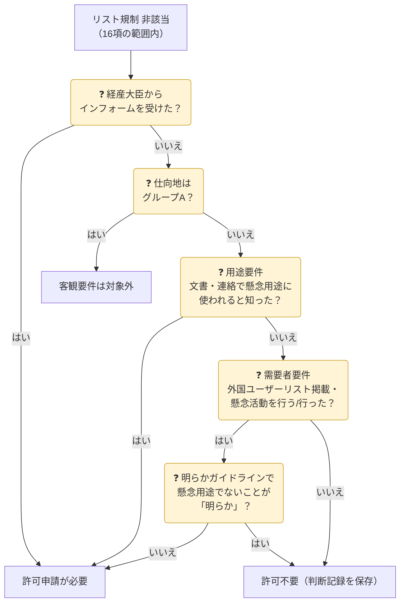
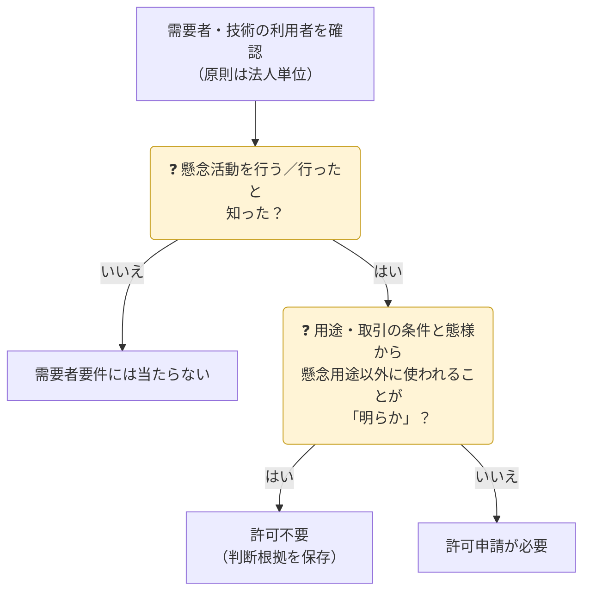
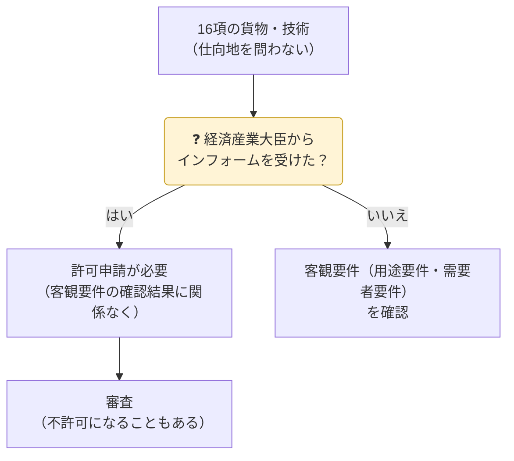
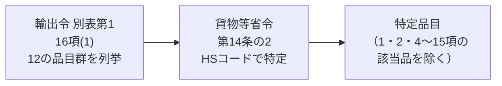
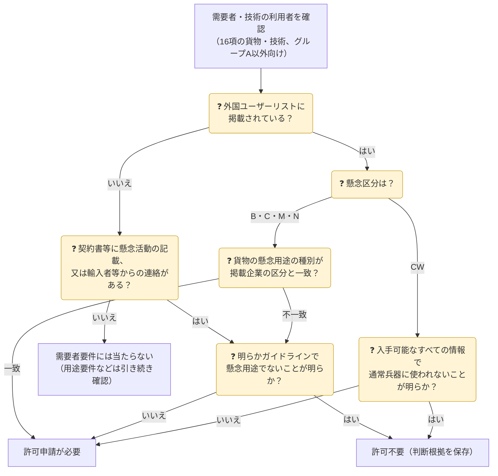
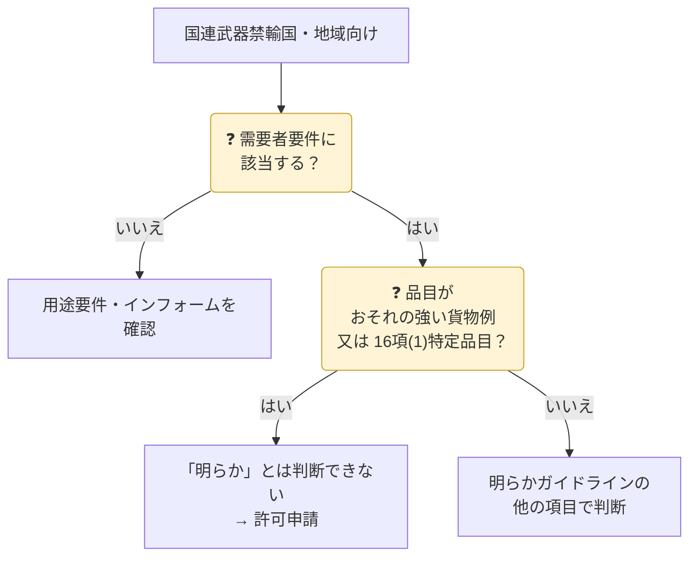
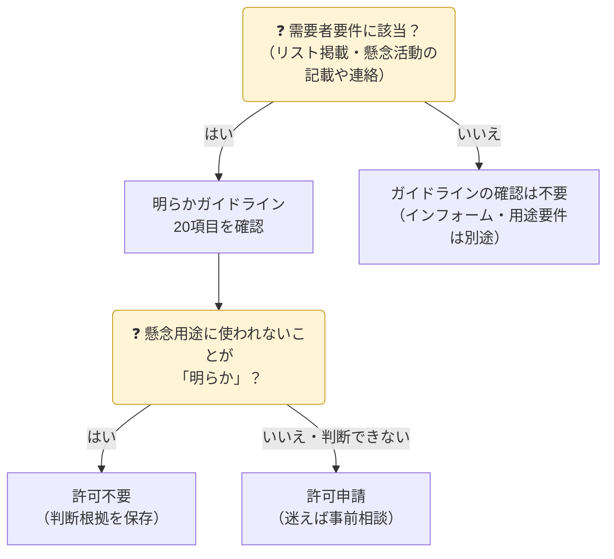

## 対象範囲

| 項目 | 内容 |
|---|---|
| 対象貨物 | 輸出令別表第1 **16項**：関税定率法別表の第25〜40類、第54〜59類、第63類、第68〜93類、第95類（**食料品・木材等を除くほぼ全て**）。2025年10月から **16項(1)（特定品目）** と **16項(2)（その他）** に区分（→ [特定品目](#16項1特定品目)） |
| 対象技術 | 外為令別表 16項（上記貨物の設計・製造・使用技術） |
| 仕向地 | 客観要件は**グループA以外**。グループA向けはインフォームのみ |
| 種類 | ① 大量破壊兵器等キャッチオール ② 通常兵器キャッチオール |

{}
1. **グループA向け**にもインフォーム要件を新設（大量破壊兵器等・通常兵器とも。→ [インフォーム要件](#インフォーム要件)）
2. 16項を分割し、**16項(1)の特定品目**（工作機械・レーダー・集積回路・航空機関連・航法装置・検査装置 等、HSコードで指定）について、**一般国向け**に客観要件を新設
3. **国連武器禁輸国・地域向け**に需要者要件を新設

あわせて、外国ユーザーリストに**通常兵器の懸念団体**も掲載されるようになりました。対象HSコード・要件の詳細は[経済産業省の資料](https://www.meti.go.jp/policy/anpo/law_document/20250409_catchallshiryou.pdf)で確認してください。
{}

## 判定フロー

> 通常兵器キャッチオールの用途要件・需要者要件は、**仕向地と品目（16項(1)か(2)か）で適用範囲が異なります**（下のタブ参照）。

## 大量破壊兵器等 vs 通常兵器


{}
| 要件 | 内容 | 対象地域 |
|---|---|---|
| 用途要件 | 核兵器・化学兵器・生物兵器・ミサイルの開発等に用いられるおそれ（別表の懸念行為を含む） | グループA以外 |
| 需要者要件 | 需要者が大量破壊兵器等の開発等を行う／行った（外国ユーザーリスト掲載 等） | グループA以外 |
| インフォーム要件 | 経産大臣から許可申請をすべき旨の通知 | **全地域**（グループAは2025年10月から） |
{}
{}
| 仕向地 | 用途要件 | 需要者要件 | インフォーム |
|---|---|---|---|
| グループA | ― | ― | ○（新設） |
| 国連武器禁輸国・地域（別表第3の2） | ○ | ○（新設） | ○ |
| 上記以外（一般国） | ○ 16項(1)の特定品目のみ（新設） | ○ 16項(1)の特定品目のみ（新設） | ○ |

「通常兵器の開発等に用いられる**おそれの強い貨物例**」も公表されています（→ [おそれの強い貨物例](#おそれの強い貨物例)）。
{}


## 用途要件

輸出する貨物・提供する技術が**懸念される用途に使われる**ことを、契約書などの文書や相手方からの連絡で知った場合に、許可が必要になる要件です。

### 「知ったとき」とは

| きっかけ | 中身 |
|---|---|
| 文書等への記載 | 輸出に関する**契約書**、又は輸出者が入手した**文書・図画・電磁的記録**（メール・データを含む）に、懸念用途に使われる旨が記載・記録されている |
| 相手方からの連絡 | **輸入者・需要者やその代理人**から、懸念用途に使われる旨の連絡を受けた |

> 基準は、文書や連絡という客観的な情報です。ただし、入手した文書のうち都合の悪い情報から目をそらすことは認められません（→ [明らかガイドライン](#明らかガイドライン)の基本ルール）。

### 何が「懸念用途」か


{}
**核兵器等の開発等**、又は**省令別表に掲げる行為**に使われる場合です。

| 区分 | 内容 |
|---|---|
| 核兵器等の開発等 | 核兵器、軍用の化学製剤・細菌製剤、それらの散布装置、射程又は航続距離**300km以上**のロケット・無人航空機の、開発・製造・使用・貯蔵 |
| 別表① | 核燃料物質・核原料物質の開発等（軽水炉の運転に専ら付帯するものを除く）、核融合に関する研究（専ら天体・専ら核融合炉に関するものを除く） |
| 別表② | 原子炉（発電用の軽水炉を除く）とその部分品・附属装置の開発等 |
| 別表③ | 重水の製造 |
| 別表④ | 核燃料物質の加工（原子炉等規制法） |
| 別表⑤ | 使用済燃料の再処理（原子炉等規制法） |

根拠：核兵器等開発等省令（平成13年経済産業省令第249号）第一号・別表、技術は核兵器等開発等告示の第一号
{}
{}
**輸出令別表第1の1項の貨物（武器。核兵器等を除く）の開発・製造・使用**に使われる場合です。

次の場合は用途要件に当たりません（省令別表）。

| 除外 | 内容 |
|---|---|
| 民生用の銃砲等 | 開発等される銃砲等が産業・娯楽・スポーツ・狩猟・救命用である旨が**文書等に記載され、かつ**輸入者等から連絡を受けている場合（空気銃・散弾銃・ライフル銃、救命銃・もり銃等の産業用銃、産業用の発破器・火薬等） |
| 自衛隊等の法定活動 | 在外邦人等の保護・輸送、国際緊急援助活動、PKO、海賊対処など、法律・閣議決定に基づく活動のための輸出 |

根拠：通常兵器開発等省令（平成20年経済産業省令第57号）第一号・別表、技術は通常兵器開発等告示の第一号
{}


### どの取引で確認するか

| 仕向地 | 大量破壊兵器等の用途要件 | 通常兵器の用途要件 |
|---|---|---|
| グループA | ― | ― |
| 一般国 | 16項の全品目 | **16項(1)特定品目のみ** |
| 国連武器禁輸国・地域 | 16項の全品目 | 16項の全品目 |

技術の提供（外国での提供・非居住者への提供）や、技術を記録した媒体の輸出、電気通信での送信も同じく対象です。

{}
用途要件に当たった場合は、**そのまま許可申請が必要**です。[需要者要件](#需要者要件)のような「[明らかガイドライン](#明らかガイドライン)で懸念用途に使われないことが明らかなら許可不要」という例外はありません。
{}

{}
- 営業担当が受け取った**メールや打合せメモ**に、ミサイル開発・軍の兵器工場向けといった記載があったのに、輸出管理部門へ共有されなかった
- 代理店経由の取引で、**代理人からの連絡**（最終用途の説明）を記録していなかった

「文書・図画・電磁的記録」には、契約書以外に社内外でやり取りした資料も含まれます。入手した情報を輸出管理部門に集める仕組みが必要です。
{}

## 需要者要件

貨物の**需要者**（技術の**利用者**）が、懸念される活動を**行う**又は**行った**ことを知った場合に、許可が必要になる要件です。用途要件と違い、「明らか」なら許可不要になる例外があります。

### 「知ったとき」とは

| きっかけ | 中身 |
|---|---|
| 外国ユーザーリスト | 需要者が[外国ユーザーリスト](#外国ユーザーリスト)に**掲載されている**（通達上、「知ったとき」に含まれる） |
| 文書等への記載 | 契約書や輸出者が入手した文書等（告示で定めるもの）に、需要者が懸念活動を行う／行った旨が記載・記録されている |
| 相手方からの連絡 | 輸入者等から、需要者が懸念活動を行う／行った旨の連絡を受けた |

### 懸念活動と対象取引

| | 大量破壊兵器等 | 通常兵器 |
|---|---|---|
| 懸念活動 | **核兵器等の開発等**（開発・製造・使用・貯蔵） | **1項の貨物（武器）の開発・製造・使用** |
| 対象取引 | グループA以外向けの16項の全品目 | 一般国向けの**16項(1)特定品目**、国連武器禁輸国・地域向けの16項の全品目 |
| 根拠 | 核兵器等開発等省令 第二号（行う）・第三号（行った） | 通常兵器開発等省令 第二号（行う）・第三号（行った） |
| 「明らか」の判断 | [明らかガイドライン](#明らかガイドライン)で確認（⑰イなど） | 同じガイドラインで確認（⑰ロ・⑲など） |

> 通常兵器の需要者要件は2025年10月9日に新設されました。それまで通常兵器キャッチオールの客観要件は用途要件だけでした。

### 「需要者」はどこまでか（経済産業省Q&Aより）

需要者は**法人単位**で判断するのが原則です。

| ケース | 扱い |
|---|---|
| 取引先の事業部は民生品を扱うが、**同じ会社の別の事業部**が通常兵器を開発している | **需要者要件に当たる**（同一法人のため） |
| 取引先の**グループ企業**（別法人）が通常兵器を開発している | 取引先自身で判断する。民生用途が明らかなら許可不要 |
| 取引先を**軍事企業（別法人）が運営**している、株式保有・役員派遣がある | 別法人であれば需要者には当たらない |
| 取引先が**軍需企業**だとホームページで分かった | 直ちに許可申請が必要にはならない。用途・取引の条件と態様から通常兵器以外に使われることが明らかなら許可不要 |
| 取引先のホームページに「**軍事関連のライセンスを取得**」とある | 用途・需要者の確認を特に慎重に行う。民生用途が明らかなら許可不要 |
| 需要者が未確定の**ストック販売** | 輸入者・取引の相手方について確認する |

{}
- 取引先の**法人名・所在地**を特定し、外国ユーザーリスト（別名を含む）と照合します。
- 大企業では、取引する事業部だけでなく**法人全体の事業内容**（防衛事業の有無）を確認します。
- 我が国の防衛省・自衛隊・警察・海上保安庁が納入先の貨物を修理などで輸出する場合は、許可申請は不要とされています（経済産業省Q&A）。
- 判断に迷う場合は、経済産業省 安全保障貿易審査課に相談できます。
{}

## インフォーム要件

経済産業大臣から「**許可の申請をすべき旨の通知**」（インフォーム）を受けた場合、その貨物の輸出・技術の提供には許可が必要になります。輸出者自身の確認（客観要件）とは別に、**当局の判断**で許可を求める仕組みです。

| 項目 | 内容 |
|---|---|
| 何が起きるか | 通知に係る貨物の輸出・技術の提供は、**許可を受けなければできない** |
| 客観要件との関係 | 客観要件に当たらなくても、「明らかガイドライン」で懸念がないと判断しても、**許可申請が必要**（キャッチオール通達「３．」） |
| 通知の性質 | 経済産業省が「大量破壊兵器等（又は通常兵器）の開発等に用いられるおそれがある」と判断して行うもの。**申請しても許可されないことがある** |
| 対象 | 16項の貨物、16項の技術（外国での提供・非居住者への提供、技術を記録した媒体の輸出、電気通信での送信を含む） |
| 仕向地 | **全地域**。グループA向けも2025年10月9日から対象（懸念国がグループAを経由して迂回調達するのを防ぐため） |

### 仕向地別：キャッチオールの要件の全体像（2025年10月〜）

| 仕向地 | 大量破壊兵器等 客観要件 | 大量破壊兵器等 インフォーム | 通常兵器 客観要件 | 通常兵器 インフォーム |
|---|---|---|---|---|
| グループA | ― | ○（新設） | ― | ○（新設） |
| 一般国 | ○ | ○ | 16項(1)特定品目のみ○ | ○ |
| 国連武器禁輸国・地域 | ○ | ○ | ○ | ○ |

### 根拠規定

| 対象 | 大量破壊兵器等 | 通常兵器 |
|---|---|---|
| 貨物（グループA以外） | 輸出令 第4条第1項第3号ロ・第4号ロ | 輸出令 第4条第1項第3号ニ・第4号ニ |
| 貨物（グループA） | 輸出令 第1条第3項（外為法48条2項）、第4条第2項第3号イ | 輸出令 第1条第3項（外為法48条2項）、第4条第2項第3号ロ |
| 技術 | 貿易外省令 第9条第2項第7号ロ・第8号ロ | 貿易外省令 第9条第2項第7号ニ・第8号ニ |

> 輸出令の特例規定（第4条）は「インフォームを受けたとき」を除外事由として定める形になっています。つまり、通知を受けると許可不要の特例が使えなくなり、許可が必要になります。

{}
- 通知に係る貨物・技術の**出荷・提供をいったん止め**、社内の輸出管理部門へ回します。
- 通知の対象（貨物・需要者・取引）を正確に確認し、**許可申請**します。
- 通知を受けた事実と対応の記録を保存します。
{}

{}
グループA向けは以前キャッチオールの対象外だったため、CPにインフォームを受けたときの手続がない企業があります。**グループA向けの取引でもインフォームの有無を確認する手順**をCPに入れておきます（CISTECのモデルCP見直しでも指摘されています）。
{}

## 16項(1)：特定品目

2025年10月9日から、16項は **(1) 特定品目** と **(2) それ以外** に分かれました。特定品目は、兵器に転用されるリスクが高い汎用品です。**一般国**（グループAと国連武器禁輸国以外の国・地域）向けで通常兵器キャッチオールの客観要件がかかるのは、この特定品目だけです。

### どう決まるか（2段構え）

| 区分 | HSコード（貨物等省令 第14条の2） | 輸出令の品目（概要） |
|---|---|---|
| 工作機械 | 84.56〜84.61 | レーザー・放電等の除去加工機、ウォータージェット切断機、マシニングセンター、旋盤、ボール盤・フライス盤、研削盤、歯切り盤・切断機 等 |
| レーダー・無線 | 85.26 | レーダー、航行用無線機器、無線遠隔制御機器 |
| 集積回路 | 85.42（**8542.90＝部分品を除く**） | 集積回路 |
| 宇宙・無人機 | 8802.60、88.06、88.07（8802.60・88.06の部分品に限る） | 宇宙飛行体・打上げ用ロケット、無人航空機、それらの部分品 |
| 航行用機器 | 9014.20、9014.80 | 航空・宇宙用の航行機器、その他の航行用機器 |
| 分析・測定機器 | 9027.50、9030.20、9030.32、9030.39 | 光学式の分析機器、オシロスコープ、記録装置付きのマルチメーター・電気測定機器 |

> 輸出令は「航空機」「物理・化学分析機器」なども広く列挙していますが、実際の対象は省令のHSコードで絞られています。有人航空機（8802.60以外の88.02項）などは特定品目に入りません。

### 仕向地別に何を確認するか（通常兵器キャッチオール）

| 仕向地 | 16項(1) 特定品目 | 16項(2) その他 |
|---|---|---|
| グループA | インフォームのみ | インフォームのみ |
| 一般国 | **用途要件＋需要者要件**＋インフォーム | インフォームのみ |
| 国連武器禁輸国・地域 | 用途要件＋需要者要件＋インフォーム | 用途要件＋需要者要件＋インフォーム |

| 要件 | 一般国向け特定品目での中身 |
|---|---|
| 用途要件 | **通常兵器の開発・製造・使用**に用いられることを文書・連絡で知った（→ [用途要件](#用途要件)） |
| 需要者要件 | 需要者が**通常兵器の開発等を行う又は行った者**（外国ユーザーリストの通常兵器懸念団体 等）。明らかガイドラインで懸念がないと「明らか」なら許可不要（→ [需要者要件](#需要者要件)） |
| 技術 | 特定品目の設計・製造・使用に係る**技術の提供**も同じく対象（外為令） |

{}
- 特定品目は**HSコードで決まる**ため、メーカーに問い合わせなくても輸出者自身で判定できます。
- 手順は2通りあります。「特定品目か」を先に確認する方法と、用途・需要者で懸念が出た案件だけ「特定品目か」を確認する方法です。取引先に確認を頼む場合は、懸念が出た案件に絞ります。
- 1・2・4〜15項の該当品は特定品目から除かれます（リスト規制側で管理）。
{}

{}
一般国向けの特定品目で許可が必要になった場合でも、次の取引などは**特別一般包括許可**を使えます（包括許可取扱要領）。

- 特定の地域（防衛装備移転協定を結んだインド、インドネシア、シンガポール、タイ、フィリピン、ベトナム、マレーシア 等）の**正規軍等**、又はその**通常兵器の開発等の委託を受けた者**が需要者の取引
- 1項の貨物・技術の許可を受けた取引と**同一の契約書等**による取引
{}

## 外国ユーザーリスト

大量破壊兵器等や通常兵器の開発等への関与の懸念が払拭されない外国の企業・組織を、経済産業省がまとめて公表しているリストです。キャッチオールの**需要者要件**を確認するための参照資料で、**禁輸リストではありません**。

### 最新版の概要（2025年10月9日適用）

| 項目 | 内容 |
|---|---|
| 掲載数 | **835団体**（前回から87増）、**15か国・地域** |
| 懸念区分 | 大量破壊兵器等：**B**（生物）・**C**（化学）・**M**（ミサイル）・**N**（核）／ 通常兵器：**CW** |
| 内訳 | 大量破壊兵器等のみ 595、通常兵器のみ 54、両方 186（通常兵器区分は計240） |
| 変更点 | 2025年10月の通常兵器キャッチオール見直しに合わせ、**通常兵器（CW）区分を初めて追加** |
| 掲載情報 | 国・地域名、企業・組織名、別名、懸念区分 |

| 国・地域 | 掲載数 | うち大量破壊兵器等 | うち通常兵器 |
|---|---:|---:|---:|
| イラン | 257 | 247 | 81 |
| 北朝鮮 | 154 | 153 | 33 |
| 中国 | 127 | 117 | 62 |
| パキスタン | 103 | 103 | 0 |
| ロシア | 100 | 67 | 63 |
| アラブ首長国連邦 | 29 | 29 | 0 |
| 香港 | 22 | 22 | 0 |
| シリア | 19 | 19 | 0 |
| レバノン | 9 | 9 | 0 |
| 台湾 | 5 | 5 | 0 |
| エジプト | 3 | 3 | 0 |
| アフガニスタン | 2 | 2 | 1 |
| イエメン | 2 | 2 | 0 |
| インド | 2 | 2 | 0 |
| イスラエル | 1 | 1 | 0 |

> 本サイトで経済産業省公表のリスト（PDF）を集計した数値です。両方の区分を持つ団体があるため、内訳の合計は掲載数と一致しません。

### 掲載企業が需要者のときの判断

| 場面 | 扱い（経済産業省Q&Aより） |
|---|---|
| 掲載企業の区分（B・C・M・N）と、貨物の懸念用途の種別が**一致** | **許可申請が必要**。懸念用途の種別は「おそれの強い貨物例」で確認できます |
| 区分が**一致しない** | それだけで許可不要とはならない。明らかガイドラインで確認します |
| 掲載企業の区分が**通常兵器（CW）** | 通常の商慣習で入手した書類にとどまらず、**入手可能なすべての文書その他の情報**で用途・取引の態様・条件を確認し、「明らか」といえなければ許可申請（明らかガイドライン⑰ロ） |
| 掲載**されていない**需要者 | 許可不要とは限らない。契約書等に懸念活動の記載があったり、輸入者等から連絡を受けたりした場合は需要者要件に当たります |
| リストから**外れた**企業 | 懸念がある程度払拭されたという判断にすぎず、通常のキャッチオール手続で用途を確認します |

{}
通常兵器の需要者要件がかかるのは、**一般国向けの16項(1)特定品目**と、**国連武器禁輸国・地域向けの全品目**です（→ [特定品目](#16項1特定品目)）。一般国向けの16項(2)の貨物では、CW区分の掲載企業向けでも需要者要件はかかりません（インフォームを受けた場合は別です）。
{}

{}
- 掲載名だけでなく**別名**でも照合します。表記ゆれ（英字・略称）にも注意します。
- 図書館・大学・商社など、一見無関係な組織も掲載されています。**フロント企業**として懸念貨物の調達に使われることがあるためです。
- リストは随時改正されます。取引審査のたびに**最新版**で照合し、照合した版と結果を記録します。
{}

## おそれの強い貨物例

リスト規制に**該当しない**汎用品のうち、兵器の開発等に使われるおそれが特に強いものを、経済産業省が例示したリストです。キャッチオール通達（平成24・03・23貿局第1号・輸出注意事項24第24号）から抜粋して公表されています。

| | 核兵器等の開発等に用いられるおそれの強い貨物例 | 通常兵器の開発、製造又は使用に用いられるおそれの強い貨物例 |
|---|---|---|
| 品目数 | **41品目**（＋シリア向けの追加リスト） | **34品目**（2025年10月9日施行版） |
| 対象になる場面 | これらの貨物の輸出・技術提供全般 | **国連武器禁輸国・地域**（輸出令別表第3の2）を仕向地等とする輸出・技術提供 |
| 16項(1)との関係 | ― | 16項(1)の**特定品目は除く**（特定品目は別に管理） |
| 求められること | 用途・需要者の確認を**特に慎重に**行う | 用途・需要者の確認を**特に慎重に**行う |


{}
| 分野 | 品目（番号は原資料） |
|---|---|
| 材料 | 1 ニッケル合金・チタン合金／2 焼結磁石／3 焼結磁石の製造装置／4 作動油に使えるりん酸エステル系の液体／5 有機繊維・炭素繊維・無機繊維 |
| 機械・工作機械 | 6 軸受／7 数値制御工作機械、鏡面仕上げ用工作機械、測定装置／10 電子部品実装ロボット |
| 電子・通信 | 8 二次セル／9 波形記憶装置／11 電子計算機／12 伝送通信装置／13 フェーズドアレーアンテナ／14 通信妨害装置／15 電波を出さずに位置を探知する装置 |
| センサー・レーザー | 16 光検出器・その冷却器・光検出器を用いた装置／17 センサー用光ファイバー／18 レーザー発振器／19 磁力計・水中電場センサー・磁場勾配計／20 重力計／21 レーダー |
| 航法 | 22 加速度計／23 ジャイロスコープ／24 慣性航法装置／25 天測航法・衛星航法の受信装置、航空機用高度計 |
| 海洋 | 26 水中用カメラ／27 大気から遮断された状態で使える動力装置／28 開放回路式の自給式潜水用具 |
| 推進・航空・試験 | 29 ガスタービンエンジン／30 ロケット推進装置／31 29・30の製造装置／32 航空機／33 振動試験装置・風洞・環境試験装置／34 フラッシュ放電型エックス線装置 |

※ 各品目の部分品を含むものがあります。正確な範囲は原資料で確認してください。
{}
{}
| 懸念される用途 | 品目（番号は原資料） |
|---|---|
| 核兵器 | 1 リン酸トリブチル（TBP）／5 口径75mm以上のアルミニウム管／10 周波数変換器／11 質量分析計・イオン源／16 高周波用オシロスコープ・波形記憶装置／17 直流安定化電源／18 大型発電機／19 大型真空ポンプ／20 耐放射線ロボット／22 放射線測定器 |
| 核兵器・ミサイル | 2 炭素繊維・ガラス繊維・アラミド繊維／3 チタン合金／4 マルエージング鋼／6 しごきスピニング加工機／7 数値制御工作機械／8 アイソスタチックプレス／9 フィラメントワインディング装置／12 振動試験装置／13 遠心力釣り合い試験器／14 耐食性の圧力計・圧力センサー／15 大型の非破壊検査装置／21 TIG溶接機・電子ビーム溶接機／26 人造黒鉛 |
| ミサイル | 23 微粉末を製造できる粉砕器／24 カールフィッシャー方式の水分測定装置／25 プリプレグ製造装置／27 ジャイロスコープ／28 ロータリーエンコーダ／29 大型トラック（トラクタ・トレーラー・ダンプを含む）／30 クレーン車 |
| 生物兵器 | 31 密閉式の発酵槽／32 遠心分離器／33 凍結乾燥機 |
| ミサイル・化学兵器 | 34〜38 耐食性の反応器・かくはん機・熱交換器（凝縮器）・蒸留塔（吸収塔）・充てん用の機械 |
| ミサイル・生物・化学兵器 | 39 噴霧器を搭載するよう設計された無人航空機（娯楽・スポーツ用の模型航空機を除く）／40 UAVに搭載するよう設計された噴霧器 |
| 化学兵器 | 41 フェンタニル類（フェンタニル、アルフェンタニル、カルフェンタニル、レミフェンタニル、スフェンタニル） |
{}
{}
仕向地が**シリア**の場合は、41品目に加えて次の貨物（21区分）も用途・需要者を特に慎重に確認します。

| 懸念される用途 | 品目の例 |
|---|---|
| 化学兵器 | ドラフトチャンバー、指定の化学物質（塩素、アセトン、エチレングリコール、メタノール 等の汎用化学品を多数含む）、反応器・弁・貯蔵容器などの化学プラント機器、真空ポンプ、化学物質の分析・検知装置、塩素-アルカリ電解槽とその電極・隔膜・イオン交換膜、塩素用の圧縮機 |
| 生物兵器 | バイオセーフティキャビネット・グローブボックス、バッチ式遠心分離機、発酵槽、クリーンルーム・HEPAフィルター付きファン |
| 生物・化学兵器 | フルフェイスマスクの呼吸用保護具 |
{}


### 明らかガイドラインとの関係（通常兵器）

改正後の[明らかガイドライン](#明らかガイドライン)（項目⑲）では、国連武器禁輸国・地域向けで需要者要件に当たった取引について、品目が「通常兵器のおそれの強い貨物例」又は「特定品目」に**当たらないこと**が「明らか」と判断する条件の一つになっています。

{}
- 貨物例は**例示**であり、全てを網羅したリストではありません。載っていない品目でも、懸念があれば用途要件・需要者要件の対象になります。
- 貨物例に載っていても、それだけで許可が必要になるわけではありません。**用途・需要者の確認を特に慎重に行う**対象という位置づけです。
- 大量破壊兵器等キャッチオールの需要者要件に当たった場合、⑲の「通常兵器のおそれの強い貨物例」の確認は不要です（⑲は通常兵器キャッチオール専用）。
{}

## 明らかガイドライン

正式名は「輸出者等が『明らかなとき』を判断するためのガイドライン」です。キャッチオール通達（最終改正：輸出注意事項2025第27号、令和7年11月14日施行）の「１．（６）」に定められています。

### いつ使うか

| 項目 | 内容 |
|---|---|
| 使う場面 | **需要者要件**に当たったとき（外国ユーザーリスト掲載、契約書等に懸念活動の記載、輸入者等からの連絡）。大量破壊兵器等・通常兵器の両方で共通 |
| 使わない場面 | 需要者要件に当たらない取引。毎回の取引で全項目を確認することは求められていません（経産省Q&A） |
| 用途要件との関係 | 「明らかなとき」の例外があるのは需要者要件だけです。**用途要件**（懸念用途に使われるおそれを知った）に当たれば許可申請が必要です |
| 判断の結果 | 「明らか」なら許可不要。「明らか」と判断できなければ**許可申請**が必要 |

### 確認するときの基本ルール

| ルール | 中身 |
|---|---|
| 確認の範囲 | 項目のうち、貨物の用途や取引の条件・態様からみて当てはまらないものは除いて確認します |
| 情報源 | 通常の商慣習の範囲で取引相手等から入手した文書その他の情報で確認します（⑰ロは例外で、入手可能なすべての情報） |
| 目隠しの禁止 | 入手した情報のうち、自社に都合の悪いものから**目をそらさない** |
| 疑義の扱い | 疑義があれば、**商談を進める前に**解決に努めます |
| 判断が困難なとき | 経済産業省 安全保障貿易審査課に相談できます |

### 20の確認項目

| 分類 | No. | 確認すること（要約） | 「満たさない」と推定される例 |
|---|---|---|---|
| 用途・仕様 | ① | 輸入者・需要者等から用途の**明確な説明**がある | 最終用途の情報を出したがらない |
| | ② | 需要者の事業内容・技術レベルからみて**必要とする合理的理由**がある | 小さなパン屋が高性能レーザーを数台注文／関連する事業経験がほとんどない／最終需要者が貨物運送会社 |
| 設置場所・据付 | ③ | 設置・使用場所が明確 | 設置場所の情報を出したがらない |
| | ④ | 軍事施設内・隣接地や立入制限区域なら、用途に疑わしい情報がない | 最終用途の情報を出したがらない |
| | ⑤ | 輸送・設置に過剰な安全装置・処置を求められていない | ― |
| 関連設備・原材料 | ⑥ | 使用される設備・同時に扱う原材料の説明がある | ― |
| | ⑦ | 貨物・設備・原材料の組合せが用途に照らして合理的・整合的 | 組合せの情報を出したがらない |
| | ⑧ | 異常に大量のスペアパーツを求められていない | ― |
| | ⑨ | 通常必要な関連装置の要求がある | ― |
| 表示・輸送・梱包 | ⑩ | 表示・船積みに特別な要請がない | ― |
| | ⑪ | 製品と仕向地からみて輸送ルートに異常がない | ― |
| | ⑫ | 梱包・梱包の表示に異常がない | ― |
| 支払・保証 | ⑬ | 支払対価・条件・方法に異常に好意的な提示がない | ― |
| | ⑭ | 通常程度の性能保証の要求がある | ― |
| 据付辞退・秘密保持 | ⑮ | 据付・指導など通常予想される専門家派遣の要請がある | ― |
| | ⑯ | 最終仕向地・製品について過度の秘密保持の要求がない | ― |
| 外国ユーザーリスト掲載企業等 | ⑰ | 掲載企業向けで、次のいずれにも当たらない（下表） | ― |
| | ⑱ | 掲載企業向けで、契約書等に**軍事用途**の記載がなく、そうした連絡も受けていない | ― |
| | ⑲ | 国連武器禁輸国・地域向け（又はその非居住者が需要者）で、品目が通常兵器の**おそれの強い貨物例**にも**16項(1)特定品目**にも当たらない | ― |
| その他 | ⑳ | 取引慣行上当然の質問に明確な説明がないなど、**取引上の不審点がない** | ― |

### 外国ユーザーリスト掲載企業向けの特別な項目

| 項目 | 当たると「明らか」にならないケース |
|---|---|
| ⑰イ | 掲載企業の懸念区分（核・生物・化学・ミサイル）と、貨物の懸念用途の種別（[おそれの強い貨物例](#おそれの強い貨物例)を参考に判断）が**一致**する |
| ⑰ロ | 懸念区分が**通常兵器**で、貨物が**16項(1)特定品目**のとき、**入手可能なすべての文書その他の情報**に基づいて他の項目を確認しても、懸念が払拭されない事項が残る |
| ⑱ | 契約書等に**軍事用途**（核兵器等の開発等、又は1項貨物の開発・製造・使用。スポーツ・狩猟用の銃、産業用の火薬等は除く）の記載がある、又はその旨の連絡を受けた |
| ⑲ | 国連武器禁輸国・地域向けで、品目が通常兵器の**おそれの強い貨物例**又は**16項(1)特定品目**に当たる（⑲は通常兵器キャッチオール専用） |

{}
- 「推定する」とされた例（情報を出したがらない 等）は、反証となる資料があれば覆せます。どこまで確認するかは自社の輸出管理規程に従い、**判断根拠の資料を社内に保管**します。
- 設立間もないスタートアップは「事業経験がほとんどない」のが当然なので、それだけで②の合理的理由がないとは推定されません（経産省Q&A）。
- 需要者が未確定の**ストック販売**では、輸入者・取引の相手方について需要者要件を確認します。
{}

## 客観要件の確認ポイント

| 確認先 | 見るもの |
|---|---|
| 用途 | 契約書・引合い・注文書の用途記載、設置場所、数量の妥当性 |
| 需要者 | 外国ユーザーリスト、事業内容、軍・軍関係機関との関係 |
| 取引条件 | 支払条件・輸送経路・据付/保守の辞退など不自然な点 |

{}
「リスト非該当だから何も確認しなくてよい」と考え、懸念のある需要者へ汎用品を出荷した例があります。**非該当品こそ取引審査が重要**です。
{}
