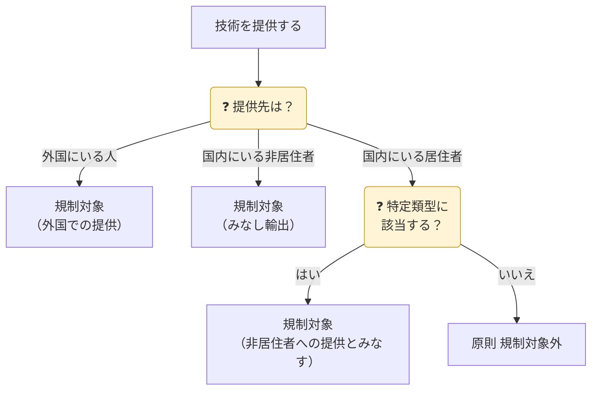

## 規制の全体像

| 項目 | 内容 |
|---|---|
| 根拠 | 外為法 25条、外為令 別表、貿易外省令、役務通達 |
| 対象技術 | 貨物の**設計・製造・使用**に必要な特定の情報（プログラムを含む） |
| 規制される提供 | ① 非居住者への提供（国内でも） ② 外国での提供（居住者相手でも） |
| 技術の形態 | 図面・仕様書・マニュアル・データ（**有形**）／ 技術指導・会議・メール・クラウド共有（**無形**） |

## どんな提供が規制されるか

## みなし輸出

**国内で**、規制対象の技術を**非居住者**に提供することも、外国への技術の「輸出」と同じく許可が必要です。これを「みなし輸出」と呼びます（外為法25条1項の「外国の非居住者に提供することを目的とする取引」）。

2022年5月1日からは運用が明確化され、**居住者であっても「特定類型」に当たる者**への提供は、非居住者への提供と同じ扱いになりました。外国の影響下にある居住者を通じて技術が流出するのを防ぐためです。

| 項目 | 内容 |
|---|---|
| 対象技術 | リスト規制技術（外為令別表1〜15項）。キャッチオールの要件に当たる場合は16項の技術も |
| 対象になる相手 | ① 非居住者（国籍は問わない） ② 特定類型に当たる居住者（**日本人を含む**） |
| 提供の形 | 口頭の説明、技術指導、図面・データの閲覧・受け渡し、メール送信、サーバー・クラウドへのアクセス許可 など（「提供」とは他者が**利用できる状態に置く**こと） |
| 許可が必要な時点 | 技術を**提供する前** |
| 根拠 | 外為法25条1項、外為令17条、役務通達「1（3）サ」・別紙1-3・別紙1-4 |

### 居住者と非居住者（原則）

| 人 | 区分 |
|---|---|
| 日本人（国内に住所） | 居住者 |
| 日本人（外国の事務所に勤務するため出国、又は2年以上外国に滞在する目的で出国） | 非居住者 |
| 外国人（国内の事務所に勤務、又は入国後6か月以上経過） | 居住者 |
| 外国人（入国後6か月未満・短期訪問） | 非居住者 |
| 外交官・国際機関の職員 | 非居住者 |

### 特定類型（役務通達「1（3）サ」）

特定類型は**居住者である自然人**に限られます。国籍は関係ありません。

| 類型 | 定義（要約） | 主な例 |
|---|---|---|
| **①** | **外国法人等**（日本国内の支店・事務所を除く）又は**外国政府等**と、雇用・委任・請負などの契約を結び、その**指揮命令に服する**、又は**善管注意義務**を負う者 | 外国企業・外国大学との兼業（勤務先が兼業を承認していても原則該当） |
| **②** | 外国政府等から**多額の金銭その他の重大な利益**を得ている、又は得ることを約している者。「多額」＝金銭に換算して本人の**年間所得の25%以上** | 外国政府の奨学金で生活する留学生、外国政府の人材招致プログラムで報酬を得る研究者 |
| **③** | 日本国内での行動について、**外国政府等の指示又は依頼**を受ける者 | ― |

「外国政府等」には、外国の政府・政府機関・地方公共団体・中央銀行・政党その他の政治団体が含まれます。

{}
日本の法人と雇用等の契約を結び、その指揮命令に服している者が、次のどちらかに当たる場合は類型①に該当しません。

- **（イ）** 日本の法人の指揮命令・善管注意義務が、外国法人等・外国政府等に対するものより**優先する**と合意している
- **（ロ）** 契約の相手が**グループ外国法人等**（日本の法人と50%以上の議決権でつながる親会社・子会社）である
{}

### 特定類型に当たるかの確認方法（役務通達 別紙1-3）

このガイドラインに沿って確認すれば、「通常果たすべき注意義務」を果たしたものと扱われます。

| 相手 | 類型①・② | 類型③ |
|---|---|---|
| **自社の指揮命令下にある者**（従業員・教職員・学生など） | 指揮命令に服した時点で**自己申告**（誓約書）により確認し、その後新たに該当した場合の**報告**を求める。就業規則で兼業・利益相反行為が禁止又は申告制なら、報告を求めていると扱われる | 契約書等の情報から該当が明らかなのに、漫然と提供しない |
| **指揮命令下にない者**（取引先の担当者など） | 取引までに通常入手する**契約書等**の情報から該当が明らかなのに、漫然と提供しない。明らかでなければ追加の確認は不要 | 同左 |
| 共通 | 経済産業省から「該当する可能性がある」と連絡を受けたのに、漫然と提供しない | 同左 |

{}
- **日本人**の従業員・研究者・学生も確認の対象です。
- 外国政府の奨学金を受けている**学生**は、原則として類型②として扱います。年間所得の25%未満と確認できれば非該当として扱えます。
- **雇用される前**に受けた外国政府の奨学金は、原則として類型②に当たりません（返済中も同じ）。ただし雇用後に返済を免除された場合は、免除額で判断します。
- 外国政府等からの**研究資金**でも、大学・研究室の所得になり本人の所得にならなければ、類型②に当たりません。
- 外国の大学の**名誉教授**の称号を得ただけでは、類型②として扱う必要はありません。
{}

{}
- 入社・着任・入学のときに、特定類型に当たるかの**誓約書**（役務通達 別紙1-4に例があります）を取ります。
- 就業規則などで**兼業・利益相反行為を申告制**にし、変化があれば報告してもらいます。
- 特定類型に当たる者には、規制対象の技術へのアクセスを制限するか、提供前に許可を取ります。
- 手続を輸出管理内部規程（CP）に書き込みます（→ [07 社内体制](../07-compliance-cp/)）。
{}

{}
- **公知の技術**（書籍・学会発表・Webで不特定多数に公開済み／公開を目的とした提供）
- **基礎科学分野の研究活動**における提供
- 工業所有権（特許）の**出願・登録**に必要な最小限の技術
- 貨物の輸出に付随する**据付・操作・保守**等の最小限の使用技術
- 一般に販売されている**市販プログラム**

詳しくは → [05 特例・例外](../05-exceptions/)
{}

{}
- 海外出張者が**規制技術の入ったPC**を持ち出し、現地で閲覧させた
- 留学生・外国人研究者に、許可なく規制技術を**研究室で教えた**
- 海外拠点の技術者が**国内サーバーの図面**にアクセスできる状態だった

いずれも「提供」に当たり得ます。アクセス権管理も輸出管理の一部です。
{}
