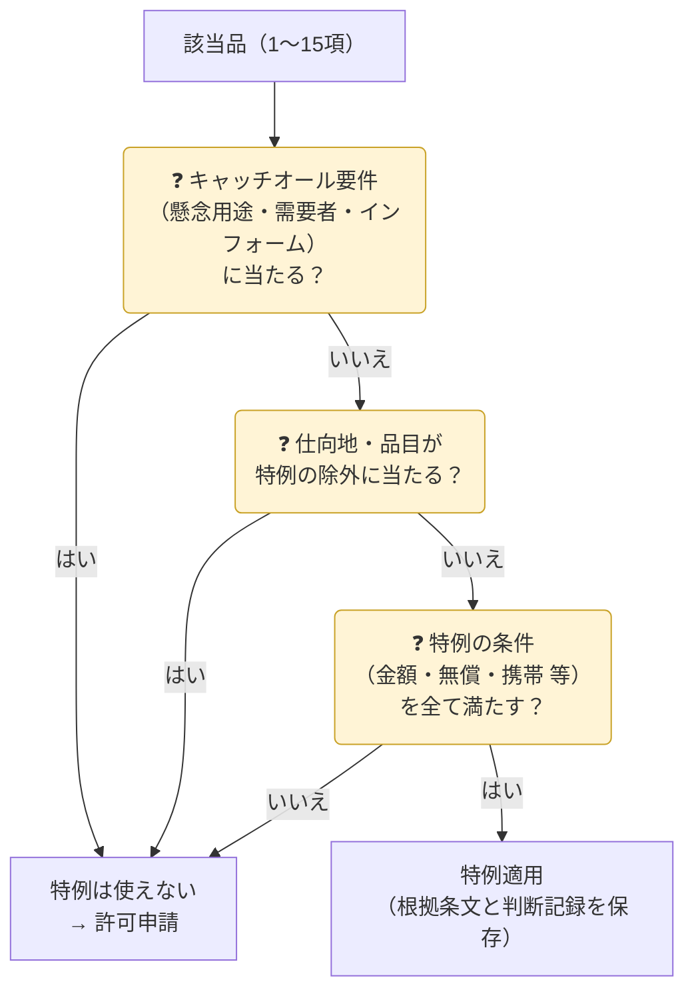

{}
特例は「**非該当になる**」のではなく「**該当品だが許可が不要になる**」だけです。該非判定・取引審査・記録保存は通常どおり必要です。キャッチオールの要件に当たる場合（懸念用途・インフォーム等）は、特例を使えないことが多いです。
{}

## 特例の早見表

| 特例 | 根拠 | 対象 | 主な条件 | 使えない例 |
|---|---|---|---|---|
| **少額特例** | 輸出令 第4条第1項第5号 | 5〜13項・15項の貨物 | 総価額 **100万円以下**（別表第3の3の品目は **5万円以下**） | 1〜4項・14項の貨物／別表第4（イラン・イラク・北朝鮮）向け／キャッチオールの要件に当たる取引 |
| **無償特例** | 輸出令 第4条第1項第2号ホ・ヘ、無償告示 | 告示に定める貨物 | 修理品の再輸出、展示会出品物の返送、ATAカルネ、一時的な出国者が本人用に携帯する一部の品目 など | 有償取引・告示に定めのない物 |
| **出国者の携帯品**（無償特例の一部） | 無償告示 第二号5・6 | 暗号機能付きのPC・スマートフォン等（9項の一部）、12項の一部 | 一時的に出国する者（滞在予定が家族同伴1年未満、その他2年未満）が携帯・別送し、本人が使用 | 上記以外のリスト規制品（許可が必要） |
| **船用品・公用品など** | 輸出令 第4条第1項第2号イ〜ニ | 船舶・航空機の用品、修理する航空機部分品、国際機関・日本の在外公館向けの公用品 | 各号の要件 | 1項の貨物 |
| **部分品の扱い** | 運用通達 1-1(7) | 他の貨物に組み込まれた部分品 | 本体で判断（部分品が主要な要素でない 等） | 容易に取り外して転用できる 等 |
| **市販プログラム** | 貨物等省令（除外規定） | 一般に販売されるソフト | 店頭・通信販売等で一般に入手可能 等 | 暗号の一部品目・特注品 |

## 技術提供の例外（役務）

| 例外 | ポイント |
|---|---|
| 公知の技術 | 不特定多数が入手・閲覧可能（書籍・Web・学会発表） |
| 基礎科学分野の研究 | 特定の製品設計・製造を目的としない理論的・実験的研究 |
| 工業所有権の出願 | 出願・登録に必要な最小限の技術 |
| 貨物に付随する使用技術 | 輸出許可を得た（または不要な）貨物の据付・操作・保守等の**最小限**の技術 |
| 市販プログラム | 一般に販売されるソフト |

## 特例を使う前のチェック

{}
- 100万円を超える注文を**複数回に分割**して少額特例を使った → 分割は認められず違反となり得ます。
- 「無償サンプルだから大丈夫」と考えたが、**無償特例の告示に当たらない**品目だった → 無償でも許可が必要です。
{}

{}
貨物の特例は主に **輸出令第4条** と関連告示、役務の例外は主に **貿易外省令第9条** に規定されています。条件は細かく改正されるため、適用のたびに最新の条文で確認してください（→ [輸出令の構造](../09-laws/export-order/)）。
{}

{}
輸出令別表第6の「携帯品・職業用具・引越荷物」の特例は、**第2条の輸出承認**（別表第2の品目など）の特例です（第4条第3項第4号）。**リスト規制品の輸出許可の特例ではありません**。リスト規制品を出張で持ち出す場合に使えるのは、上の表の「出国者の携帯品」（無償告示）に当たる一部の品目だけです。
{}
