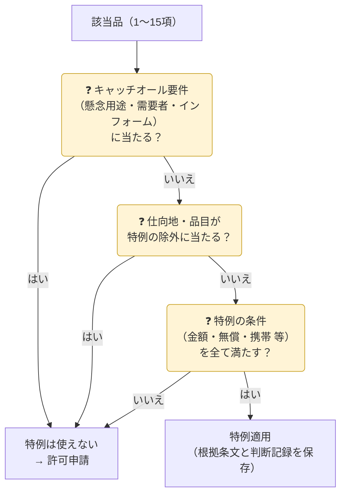

{}
特例は「**非該当になる**」のではなく「**該当品だが許可が不要になる**」だけです。該非判定・取引審査・記録保存は通常どおり必要です。キャッチオールの要件に当たる場合（懸念用途・インフォーム等）は、特例を使えないことが多いです。
{}

## 特例の早見表

| 特例 | 対象 | 主な条件 | 使えない例 |
|---|---|---|---|
| **少額特例** | 5〜13項・15項の貨物 | 総価額 **100万円以下**（一部品目は **5万円以下**） | 1〜4項の貨物／懸念のある需要者・用途 |
| **無償特例**（告示） | 告示に定める貨物 | 無償で輸入した物の返送（修理品・返品 等）、無償で一時的に輸出し返送される物 | 有償取引・告示に定めのない物 |
| **携帯品・職業用具** | 旅行者が携帯する物 | 本人が使用、一時的な持出し | 販売目的・大量 |
| **部分品の扱い** | 他の貨物に組み込まれた部分品 | 本体で判断（部分品が主要な要素でない 等） | 容易に取り外して転用できる 等 |
| **市販プログラム** | 一般に販売されるソフト | 店頭・通信販売等で一般に入手可能 等 | 暗号の一部品目・特注品 |

## 技術提供の例外（役務）

| 例外 | ポイント |
|---|---|
| 公知の技術 | 不特定多数が入手・閲覧可能（書籍・Web・学会発表） |
| 基礎科学分野の研究 | 特定の製品設計・製造を目的としない理論的・実験的研究 |
| 工業所有権の出願 | 出願・登録に必要な最小限の技術 |
| 貨物に付随する使用技術 | 輸出許可を得た（または不要な）貨物の据付・操作・保守等の**最小限**の技術 |
| 市販プログラム | 一般に販売されるソフト |

## 特例を使う前のチェック

{}
- 100万円を超える注文を**複数回に分割**して少額特例を使った → 分割は認められず違反となり得ます。
- 「無償サンプルだから大丈夫」と考えたが、**無償特例の告示に当たらない**品目だった → 無償でも許可が必要です。
{}

{}
貨物の特例は主に **輸出令第4条** と関連告示、役務の例外は主に **貿易外省令第9条** に規定されています。条件は細かく改正されるため、適用のたびに最新の条文で確認してください。
{}
