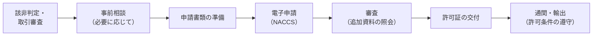

## 個別 vs 包括


{}
| 項目 | 内容 |
|---|---|
| 単位 | 取引（契約）ごと |
| 対象 | 全品目・全仕向地 |
| 審査期間 | 標準処理期間 **90日**（事前相談で短縮・円滑化） |
| 有効期間 | 原則 **6か月** |
| 向いている | 取引が単発、仕向地がグループD、機微度が高い |
{}
{}
| 項目 | 内容 |
|---|---|
| 単位 | 一定の品目・仕向地の組合せをまとめて |
| 対象 | 包括許可の種類ごとに品目・仕向地が限定 |
| 前提 | 輸出管理体制（CP・自己管理チェックリスト 等） |
| 有効期間 | 原則 **3年** |
| 向いている | 同じ品目を継続的・反復的に輸出する |
{}


## 包括許可の種類

| 種類 | 概要 | 主な前提 |
|---|---|---|
| 一般包括許可 | 別表A/Bで「一般」の品目 × グループA（輸出令別表第3）向け | 輸出者等概要・自己管理チェックリストの提出 |
| 特別一般包括許可 | 別表A/Bで「一般」の組合せ（輸出令別表第3の2・第4の地域は除く） | **CP（輸出管理内部規程）の受理**＋チェックリスト |
| 特定包括許可 | 継続的な取引関係にある特定の相手先向け | CP受理 等 |
| 特別返品等包括許可 | 返品・修理品の返送 等 | CP受理 等 |
| 特定子会社包括許可 | 日本企業の海外子会社向け | CP受理 等 |

{}
包括許可の種類・対象品目・対象地域は、通達「**包括許可取扱要領**」と、その<strong>別表A（貨物包括マトリクス）・別表B（役務包括マトリクス）</strong>で定められ、改正されます。申請前に最新版を確認してください（→ [09 関連法令](../09-laws/#包括許可の対象はどこで決まるか)）。
{}

## 申請の流れ

## 主な提出書類（個別許可の例）

| 書類 | 目的 |
|---|---|
| 輸出許可申請書 | 申請の本体 |
| 申請理由書 | 取引の概要・用途の説明 |
| 契約書・注文書の写し | 取引の実在性 |
| 仕様書・カタログ | 該当項番とスペックの確認 |
| 該非判定書（パラメータシート） | 判定根拠 |
| 需要者の誓約書 | 最終用途・再輸出しない旨の確認 |
| 需要者の概要資料 | 事業内容・懸念の有無の確認 |

{}
- **許可を受ける前に**契約締結はできても、出荷・技術提供はできません。納期は審査期間を見込んで設定します。
- 許可の**条件**（再輸出の制限・報告義務 等）は、出荷後も守る必要があります。
- 申請内容と実際の取引（数量・需要者・仕向地）が違うと、許可の効力が及ばず無許可輸出になり得ます。
{}
