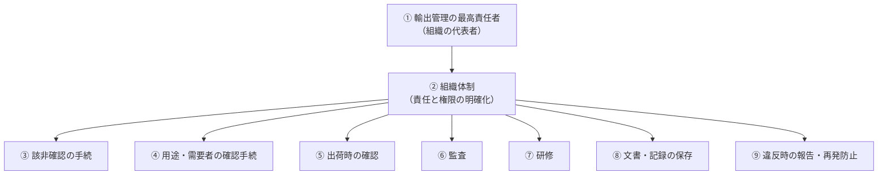

## 輸出者等遵守基準（法令上の義務）

| 基準 | 対象者 | 求められること |
|---|---|---|
| **基準1** | 業として輸出・技術提供を行う**全ての者** | ① 該非確認の責任者を選任 ② 業務従事者への法令遵守の指導 |
| **基準2** | リスト規制品を**反復継続して**輸出・提供する者 | 基準1に加えて、下の9項目の体制 |

## CP（輸出管理内部規程）の構成例

| 章 | 内容 | 担当の例 |
|---|---|---|
| 基本方針 | 法令遵守・大量破壊兵器等への不関与 | 経営層 |
| 組織 | 最高責任者・輸出管理部門・各部門の役割 | 経営層・管理部門 |
| 該非確認 | 判定手順・二重チェック・判定書の管理 | 技術部門 → 管理部門 |
| 取引審査 | 用途・需要者の確認、懸念時のエスカレーション | 営業部門 → 管理部門 |
| 出荷管理 | 現品・書類・許可条件の照合 | 物流部門 |
| 技術管理 | 技術資料の分類・アクセス権・出張時の持出し | 技術部門・情報システム |
| 監査 | 定期監査・是正 | 監査部門 |
| 教育 | 階層別・部門別研修 | 管理部門 |
| 記録保存 | 保存対象・期間・方法 | 全部門 |
| 違反時の対応 | 経産省への報告、原因分析、再発防止 | 経営層・管理部門 |

{}
CPを経済産業省に届け出て**受理**されると、特別一般包括許可などの前提を満たせます。受理後も毎年の**自己管理チェックリスト**の提出が必要です。
{}

## 記録保存

| 保存するもの | 保存期間の目安 |
|---|---|
| 法定の帳簿（許可に基づく輸出・提供の記録 等） | 法令で定める期間（**7年**） |
| 該非判定書・取引審査の記録・出荷記録 | 遵守基準に基づき社内規程で定める（**5年以上**が一般的な目安） |
| 許可証・申請書類 | 許可の有効期間終了後も一定期間 |

{}
- 判定書は残っているが、**判定の根拠資料**（仕様書の版数・スペック値）が残っていない
- 省令改正後に**再判定**していない
- 技術資料の**社外持出し・メール送信**が管理の対象外になっている
{}
