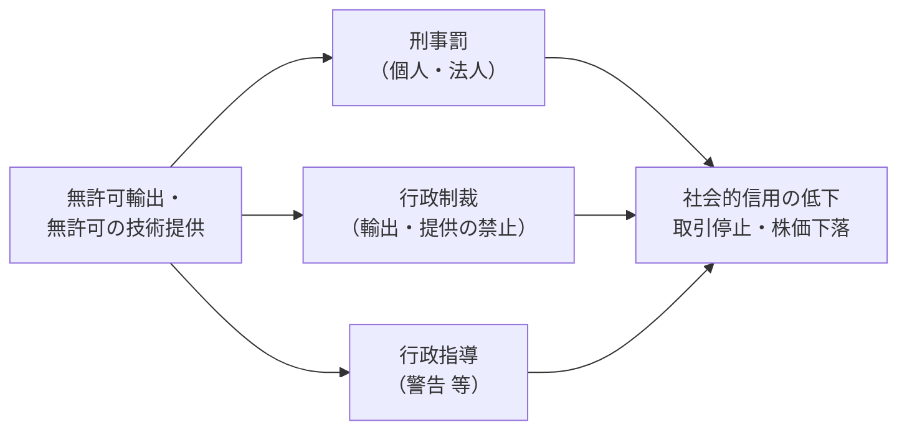

## 違反したらどうなるか

## 刑事罰（外為法）

| 違反の種類 | 個人 | 法人（両罰規定） |
|---|---|---|
| 大量破壊兵器関連の貨物・技術の無許可輸出等 | **10年以下の拘禁刑** 又は **3,000万円以下**の罰金（価格の5倍が上回ればその額）、併科あり | **10億円以下**の罰金（価格の5倍が上回ればその額） |
| 上記以外のリスト規制・キャッチオール違反 | **7年以下の拘禁刑** 又は **2,000万円以下**の罰金（価格の5倍が上回ればその額）、併科あり | **7億円以下**の罰金（価格の5倍が上回ればその額） |

{}
- 罰則は2017年の外為法改正で大幅に引き上げられました。
- 2025年6月の刑法改正施行により、「懲役」は「**拘禁刑**」に変わりました。
- 未遂や、許可条件に違反した場合の罰則もあります。
{}

## 行政制裁

| 措置 | 内容 |
|---|---|
| 輸出・技術提供の禁止 | 最長 **3年**、全ての貨物・技術（または一部）の輸出・提供を禁止 |
| 警告 | 経済産業省からの警告（行政指導）、再発防止策の報告 |

## 代表的な事例

| 年 | 事例 | 品目・項 | 教訓 |
|---|---|---|---|
| 1987 | **東芝機械ココム違反事件**：旧ソ連へ多軸同時制御の工作機械を不正輸出（潜水艦のスクリュー加工に使われたとされた） | 工作機械 | 国際問題に発展し、日本の輸出管理強化の契機に |
| 2006 | **三次元測定機の不正輸出事件**：許可を得ずに海外へ輸出され、核開発関連の懸念先で発見 | 三次元測定機（2項） | 性能の「見せかけ」による回避は重大違反。社内チェックの形骸化 |
| 2007 | **産業用無人ヘリコプターの不正輸出事件**：中国企業へ許可なく輸出 | 無人航空機（4項） | 民生品でも性能次第で規制。「農業用」は理由にならない |
| 2020〜2025 | **噴霧乾燥器をめぐる事件**：企業幹部らが逮捕・起訴されたが起訴取消し。国家賠償訴訟で捜査の違法性が認定・確定 | 噴霧乾燥器（3の2項） | 条文解釈の曖昧さのリスク。判断根拠・当局とのやり取りの記録が企業を守る |

{}
| パターン | 例 |
|---|---|
| 判定ミス | 改正前の省令で判定したまま出荷 |
| 迂回輸出 | 第三国の商社経由で懸念国へ流出 |
| 分割取引 | 少額特例を使うために注文を分割 |
| 技術の持出し | 出張PC・クラウド・メールでの図面提供 |
| 審査の形骸化 | 営業部門だけで判断し、管理部門を通さない |
{}

{}
速やかに**経済産業省（安全保障貿易検査官室）へ自主的に報告**し、原因分析と再発防止策を示すことが重要です。自主報告と誠実な対応は、処分の判断で考慮されます。
{}
