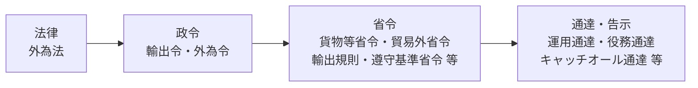
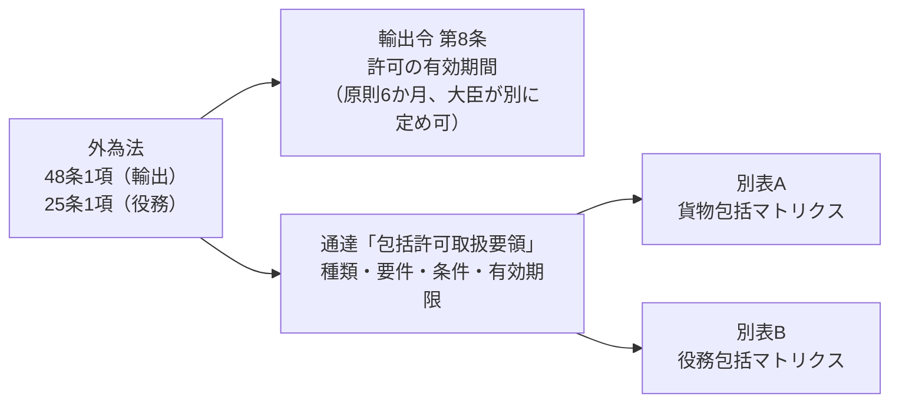

## 法令の階層

## 法律・政令・省令（e-Gov 法令検索）

| 区分 | 名称（略称） | 法令番号 | 主な内容 | 本サイトの関連ページ |
|---|---|---|---|---|
| 法律 | [外国為替及び外国貿易法](https://laws.e-gov.go.jp/law/324AC0000000228)（**外為法**） | 昭和24年法律第228号 | 25条（技術の提供）、48条（貨物の輸出）、罰則 | [01](../01-overview/)・[08](../08-penalties-cases/) |
| 政令 | [輸出貿易管理令](https://laws.e-gov.go.jp/law/324CO0000000378)（**輸出令**） | 昭和24年政令第378号 | 別表第1（1〜16項）、別表第3・第3の2・第4（国・地域）、第4条（特例）→ **[条と別表の早見表](export-order/)** | [02](../02-list-control/)・[05](../05-exceptions/) |
| 政令 | [外国為替令](https://laws.e-gov.go.jp/law/355CO0000000260)（**外為令**） | 昭和55年政令第260号 | 別表（規制技術の1〜16項） | [04](../04-technology-transfer/) |
| 省令 | [輸出貿易管理令別表第一及び外国為替令別表の規定に基づき貨物又は技術を定める省令](https://laws.e-gov.go.jp/law/403M50000400049)（**貨物等省令**） | 平成3年通商産業省令第49号 | 規制品目の具体的スペック（しきい値）、第14条の2（16項(1)特定品目のHSコード） | [02](../02-list-control/)・[03](../03-catch-all/) |
| 省令 | [輸出貿易管理規則](https://laws.e-gov.go.jp/law/324M50000400064)（**輸出規則**） | 昭和24年通商産業省令第64号 | 許可申請の手続・様式 | [06](../06-application/) |
| 省令 | [貿易関係貿易外取引等に関する省令](https://laws.e-gov.go.jp/law/410M50000400008)（**貿易外省令**） | 平成10年通商産業省令第8号 | 技術提供の許可手続・例外（公知・基礎研究 等） | [04](../04-technology-transfer/)・[05](../05-exceptions/) |
| 省令 | [輸出者等遵守基準を定める省令](https://laws.e-gov.go.jp/law/421M60000400060)（**遵守基準省令**） | 平成21年経済産業省令第60号 | 基準1・基準2（社内体制） | [07](../07-compliance-cp/) |
| 省令 | [輸出貨物が核兵器等の開発等のために用いられるおそれがある場合を定める省令](https://laws.e-gov.go.jp/law/413M60000400249)（**核兵器等開発等省令**） | 平成13年経済産業省令第249号 | 大量破壊兵器等キャッチオールの客観要件 | [03](../03-catch-all/) |
| 省令 | [輸出貨物が輸出貿易管理令別表第一の一の項の中欄に掲げる貨物（核兵器等に該当するものを除く。）の開発、製造又は使用のために用いられるおそれがある場合を定める省令](https://laws.e-gov.go.jp/law/420M60000400057)（**通常兵器開発等省令**） | 平成20年経済産業省令第57号 | 通常兵器キャッチオールの客観要件 | [03](../03-catch-all/) |

{}
e-Gov のページは**現在施行されている条文**を表示します。改正の予定・経過措置は、次の経済産業省「関係法令・改正情報」で確認します。
{}

## 通達・告示（経済産業省で公表）

通達・告示は e-Gov には載っていません。経済産業省の[関係法令・改正情報](https://www.meti.go.jp/policy/anpo/law00.html)から最新版を参照します。

| 通称 | 正式名称（概要） | 主な内容 | 本サイトの関連ページ |
|---|---|---|---|
| 運用通達 | 輸出貿易管理令の運用について | 用語の解釈、部分品・附属品の扱い、特例の運用 | [02](../02-list-control/)・[05](../05-exceptions/) |
| 役務通達 | 外為法第25条第1項等に基づき許可を要する技術を提供する取引又は行為について（4貿局第492号、最終改正：輸出注意事項2025第27号） | 技術・プログラムの解釈、居住者・非居住者、特定類型 | [04](../04-technology-transfer/#みなし輸出) |
| キャッチオール通達 | [大量破壊兵器等及び通常兵器に係る補完的輸出規制に関する輸出手続等について](https://www.meti.go.jp/policy/anpo/catchtutatu.pdf)（平成24・03・23貿局第1号・輸出注意事項24第24号、最終改正：輸出注意事項2025第27号） | 用途・需要者の確認手順、明らかガイドライン、おそれの強い貨物例、事前相談 | [03](../03-catch-all/#明らかガイドライン) |
| 無償告示 | 無償で輸出すべきもの・無償で輸入すべきものとして告示で定める貨物 | 無償特例の対象 | [05](../05-exceptions/) |
| 包括許可取扱要領 | 包括許可取扱要領（平成17・02・23貿局第1号・輸出注意事項17第7号） | 包括許可の種類・要件・条件・有効期限、別表A/B（包括マトリクス） | [06](../06-application/)・[下記](#包括許可の対象はどこで決まるか) |
| 申請・相談に関する通達 | 許可申請・該非の事前相談の手続 | 申請書類、標準処理期間 | [06](../06-application/) |

## 包括許可の対象はどこで決まるか

一般包括・特別一般包括の対象は、政令・省令ではなく**通達「包括許可取扱要領」とその別表**で決まります。

| 何が決まっているか | 規定している法令・通達 |
|---|---|
| 許可が必要であること（包括許可も「許可」の一形態） | 外為法 48条1項（貨物）・25条1項（役務） |
| 許可申請の手続・様式 | 輸出貿易管理規則 第1条、貿易外省令 |
| 許可の有効期間（原則6か月／大臣が別の期間を定められる） | 輸出令 第8条 |
| 包括許可の**種類**（一般・特別一般・特定・特別返品等・特定子会社）と要件・条件・手続・有効期限 | 通達「包括許可取扱要領」本文 |
| 包括許可の**対象となる品目×仕向地の組合せ** | 同要領 **別表A**（貨物包括マトリクス）・**別表B**（役務包括マトリクス） |

| 種類 | 対象の決まり方（別表A/B） |
|---|---|
| 一般包括許可 | マトリクスで「一般」と表記された欄のうち、仕向地が**輸出令別表第3の地域**（グループA）の組合せ |
| 特別一般包括許可 | マトリクスで「一般」と表記された欄の組合せ（輸出令別表第3の2・第4の地域を仕向地・経由地とする場合は使えない）。2〜15項の貨物を外国から輸入して返送する輸出等も含む |

{}
- 包括許可の対象は**法令本文（e-Gov）を見てもわかりません**。必ず最新の「包括許可取扱要領」と別表A/Bで確認します。
- 別表A/Bは、貨物等省令の改正（新しい規制品目の追加など）に合わせて改正されます。改正日と、自社の包括許可の条件がどの版に基づくかを確認してください。
- 特別一般包括許可を受けるには、輸出管理内部規程（CP）の届出が受理されていることなどが要件です（→ [07 社内体制](../07-compliance-cp/)）。
{}

| 参照先 | 内容 |
|---|---|
| [関係法令＞包括輸出許可・包括役務取引許可共通](https://www.meti.go.jp/policy/anpo/law10.html) | 包括許可取扱要領・別表（マトリクス）の掲載ページ |
| [包括許可申請（新規・変更・更新）、関連手続き](https://www.meti.go.jp/policy/anpo/apply-01/shinseishorui/hokatsu/) | 申請書類・手続 |
| [特別一般包括（輸出・役務）許可申請](https://www.meti.go.jp/policy/anpo/apply-01/shinseishorui/hokatsu/tokubetsuippan.html) | 特別一般包括の申請 |

## 公式サイト（経済産業省）

| ページ | 用途 |
|---|---|
| [安全保障貿易管理（トップ）](https://www.meti.go.jp/policy/anpo/) | 全体の入口・新着情報 |
| [関係法令・改正情報](https://www.meti.go.jp/policy/anpo/law00.html) | 法令・通達の一覧 |
| [改正情報](https://www.meti.go.jp/policy/anpo/law09-2.html) | 直近の改正と施行日 |
| [安全保障貿易管理の概要](https://www.meti.go.jp/policy/anpo/gaiyou.html) | 制度の概要 |
| [安全保障貿易管理ガイダンス［入門編］](https://www.meti.go.jp/policy/anpo/guidance.html) | 該非判定・取引審査の手順の解説 |
| [補完的輸出規制（キャッチオール規制）](https://www.meti.go.jp/policy/anpo/catchall.html) | キャッチオール・外国ユーザーリスト |
| [補完的輸出規制の見直しについて（2025年10月9日施行）](https://www.meti.go.jp/policy/anpo/law_document/20250409_catchallshiryou.pdf) | 見直しの説明資料（PDF） |
| [通常兵器の開発、製造又は使用に用いられるおそれの強い貨物例](https://www.meti.go.jp/policy/anpo/catch-all/20251009_tsujo_heikikamoturei.pdf) | 34品目（PDF、2025年10月9日施行版） |
| [核兵器等の開発等に用いられるおそれの強い貨物例](https://www.meti.go.jp/policy/anpo/law_document/tutatu/t04shinsei/t04shinsei_heikikamoturei.pdf) | 41品目＋シリア向け追加（PDF） |
| [仲介貿易・技術取引規制](https://www.meti.go.jp/policy/anpo/anpo05.html) | 技術提供・仲介貿易 |
| [みなし輸出管理](https://www.meti.go.jp/policy/anpo/anpo07.html) | 特定類型・みなし輸出 |
| [「みなし輸出」管理の明確化に関するQ&A](https://www.meti.go.jp/policy/anpo/law_document/minashi/minashiqa3.pdf) | 特定類型の判断例（PDF） |
| [役務通達](https://www.meti.go.jp/policy/anpo/law_document/tutatu/t10kaisei/ekimu_tutatu.pdf) | 特定類型の定義（1（3）サ）、確認ガイドライン（別紙1-3）、誓約書の例（別紙1-4）（PDF） |
| [申請、相談に関する通達](https://www.meti.go.jp/policy/anpo/law05.html) | 許可申請・事前相談 |
| [企業等の自主管理の促進](https://www.meti.go.jp/policy/anpo/compliance_programs.html) | CP（輸出管理内部規程）・自己管理チェックリスト |
| [Q&A](https://www.meti.go.jp/policy/anpo/qanda.html) | よくある質問 |
| [外国ユーザーリストの改正（2025年9月29日公表・10月9日適用）](https://www.meti.go.jp/press/2025/09/20250929006/20250929006.html) | 最新の外国ユーザーリスト（835団体、PDF） |
| [外国ユーザーリスト等に関するQ&A](https://www.meti.go.jp/policy/anpo/qanda/qanda19.html) | 外国ユーザーリスト・明らかガイドライン |

{}
ロシア・ベラルーシ等向けの輸出禁止措置は、安全保障貿易管理とは別の「貿易管理」ページで公表されています。

- [ロシア等への輸出](https://www.meti.go.jp/policy/external_economy/trade_control/02_export/17_russia/russia.html)
- [ロシア等への輸出入に関するFAQ](https://www.meti.go.jp/policy/external_economy/trade_control/02_export/17_russia/qa.html)
- [対ロシア等制裁関連](https://www.meti.go.jp/policy/external_economy/trade_control/01_seido/04_seisai/crimea.html)
- [対北朝鮮制裁関連](https://www.meti.go.jp/policy/external_economy/trade_control/01_seido/04_seisai/kitachosen.html)（全ての貨物の輸出禁止。現在の措置は2027年4月13日まで）
- [イランに対する国連安保理決議を受けた外為法に基づく措置（2025年9月29日）](https://www.meti.go.jp/press/2025/09/20250929004/20250929004.html)
{}

## 武器（1項）の移転方針

| 資料 | 内容 |
|---|---|
| [防衛装備移転三原則等について（内閣官房）](https://www.cas.go.jp/jp/gaiyou/jimu/pdf/r60405_bouei1.pdf) | 三原則と運用指針の概要。移転を禁止する場合（条約・安保理決議の義務違反、紛争当事国への移転） |
| [防衛装備移転三原則・運用指針の見直し（防衛省、2026年4月）](https://www.mod.go.jp/atla/soubiseisaku/soubiseisakugijutu/boei_sobi_iten_sangensoku_unyo_shishin_kaisei_202604.pdf) | 完成品の移転を原則可に。殺傷・破壊能力のある「武器」は協定締結国に限定 |

## 国際輸出管理レジーム・関係団体

| 名称 | 対象分野 | 対応する項 |
|---|---|---|
| [ワッセナー・アレンジメント（WA）](https://www.wassenaar.org/) | 通常兵器・汎用品 | 1・5〜15項 |
| [原子力供給国グループ（NSG）](https://www.nuclearsuppliersgroup.org/) | 原子力 | 2項 |
| [オーストラリア・グループ（AG）](https://www.australiagroup.net/) | 化学・生物兵器 | 3・3の2項 |
| [ミサイル技術管理レジーム（MTCR）](https://www.mtcr.info/) | ミサイル | 4項 |
| [CISTEC（一般財団法人 安全保障貿易情報センター）](https://www.cistec.or.jp/) | 該非判定ツール（項目別対比表・パラメータシート）、研修 | ― |
