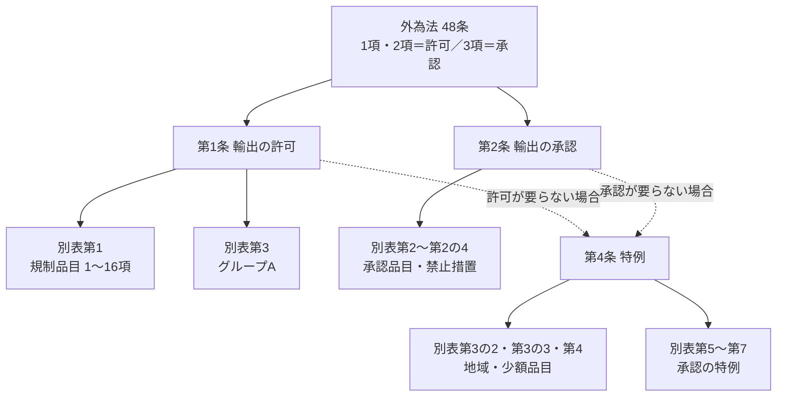

[輸出貿易管理令](https://laws.e-gov.go.jp/law/324CO0000000378)（昭和24年政令第378号。以下「輸出令」）は、外為法48条の「許可」と「承認」の対象・特例を具体的に定める政令です。**本則（第1条〜第14条）が「何をするか」を、別表が「何を・どこへ」を定める**構造になっています。

> 2026年6月5日施行の輸出令（e-Gov）をもとに整理しています。見出しは条文の見出し、説明は本サイトによる要約です。

## 全体の構造

| 区分 | 条・別表 | 役割 |
|---|---|---|
| 規制の対象 | 第1条・**別表第1** | リスト規制（1〜15項）とキャッチオール（16項）の「許可」 |
| 禁止・承認 | 第2条・**別表第2系** | 特定の貨物・仕向地の「承認」（北朝鮮・ロシア等への禁止措置を含む） |
| 仕向地の区分 | **別表第3・第3の2・第4** | グループA、国連武器禁輸国、懸念国 |
| 特例 | 第4条・**別表第3の3・第5〜第7** | 許可・承認が要らない場合 |
| 手続・執行 | 第5条〜第13条 | 税関の確認、有効期間、報告、権限の委任 など |
| 罰則との関係 | 第14条 | 外為法の重い罰則が適用される貨物の範囲 |

## 本則（第1条〜第14条）

| 条 | 見出し | 簡単な説明 | 関係する別表 | 関連ページ |
|---|---|---|---|---|
| **第1条** | 輸出の許可 | 別表第1の貨物を下欄の地域へ輸出するときは、外為法48条1項の**許可**が必要（第1項）。16項の貨物をグループA（別表第3）へ輸出するときは、48条2項の許可が必要（第3項。インフォームを受けた場合に限られる。第4条第2項） | 第1、第3 | [02](../../02-list-control/)・[03](../../03-catch-all/) |
| **第2条** | 輸出の承認 | 別表第2などの貨物・仕向地は、外為法48条3項の**承認**が必要。北朝鮮（第1号の2）、ベラルーシ・ロシア（第1号の3・第1号の4）、ウクライナの一部地域（第1号の5）、ロシア等の指定団体（第1号の6〜第1号の8）、委託加工貿易（第2号） | 第2、第2の2、第2の3、第2の4 | [01 早見マトリクス](../../01-overview/#0-輸出できる早見マトリクス) |
| 第3条 | （削除） | ― | ― | ― |
| **第4条** | 特例 | 許可・承認が**要らない場合**。第1項＝許可の特例（少額特例・無償特例・キャッチオール非該当 など）、第2項＝グループA向け16項の特例、第3項〜第5項＝承認の特例 | 第3、第3の2、第3の3、第4、第5、第6、第7 | [05](../../05-exceptions/) |
| 第5条 | 税関の確認等 | 税関は、輸出者が許可・承認を受けていること（又は不要であること）を確認し、結果を経済産業大臣に通知する | ― | ― |
| 第6条 | （削除） | ― | ― | ― |
| 第7条 | 輸出の事後審査 | 経済産業大臣は、第11条の報告によって、輸出が法令に従っているかを審査する | ― | ― |
| **第8条** | 許可及び承認の有効期間 | 許可・承認の有効期間は**6か月**。経済産業大臣は、特に必要があれば別の期間を定め、又は延長できる（包括許可の有効期間など） | ― | [06](../../06-application/) |
| 第9条 | 法令の違反に対する制裁の通知 | 外為法53条の行政制裁（輸出禁止）をしたときは、税関に通知する | ― | [08](../../08-penalties-cases/) |
| 第10条 | 使用人 | 外為法53条4項1号の「使用人」（行政制裁の対象になる営業所の統括者など）の範囲 | ― | [08](../../08-penalties-cases/) |
| 第11条 | 報告 | 経済産業大臣は、輸出者・生産者などに必要な報告を求めることができる | ― | ― |
| 第12条 | 権限の委任 | 一部の承認の権限や、有効期間の延長の権限などを税関長に委任する | 第2 | ― |
| 第13条 | 政府機関の行為 | 経済産業大臣が行う輸出には、この政令を適用しない | ― | ― |
| **第14条** | 核兵器等の開発等に用いられるおそれが特に大きい貨物 | 外為法の**重い罰則**（大量破壊兵器関連）の対象となる貨物＝別表第1の1項（一部を除く）と2〜4項の貨物 | 第1 | [08](../../08-penalties-cases/) |

> 附則第3項：令和9年4月13日までの間、第2条第1項第1号の2を「北朝鮮を仕向地とする貨物」と読み替え、**北朝鮮向けの全ての貨物**を承認制（輸出禁止）にしています。

### 第4条（特例）の中身

第4条は項・号ごとに、どの規制の特例かが分かれています。

| 項・号 | 何の特例か | 内容 |
|---|---|---|
| 第1項 柱書 | 許可（外為法48条1項） | 以下の場合は許可不要。ただし、1項（武器）の貨物は原則として対象外 |
| 第1項 第1号 | 〃 | 外国向けの仮陸揚げ貨物 |
| 第1項 第2号 イ〜ニ | 〃 | 船舶・航空機の用品、修理する航空機部分品、国際機関の貨物、日本の在外公館向けの公用品 |
| 第1項 第2号 ホ・ヘ | 〃 | **無償特例**（無償告示に定める貨物） |
| 第1項 第3号 | 〃 | 16項(1)特定品目で、キャッチオールの要件（用途・需要者・インフォーム）に当たらないとき |
| 第1項 第4号 | 〃 | 16項(2)の貨物で、キャッチオールの要件に当たらないとき |
| 第1項 第5号 | 〃 | **少額特例**：5〜13項・15項の貨物で総価額100万円以下（別表第3の3の品目は5万円以下）。別表第4（イラン・イラク・北朝鮮）向けを除く |
| 第2項 | グループA向け16項の許可（第1条第3項） | インフォームを受けていなければ許可不要 |
| 第3項 | 承認（第2条） | 仮陸揚げ貨物、別表第5の貨物、一定の廃棄物、別表第6の携帯品・職業用具・引越荷物 |
| 第4項 | 承認（第2条第1項第1号） | 別表第7の金額以下の少額貨物 |
| 第5項 | 承認（第2条第1項第2号） | 委託加工貿易で総価額100万円以下 |

{}
別表第5（無償の商品見本など）や別表第6（携帯品・職業用具）は、**第2条の承認の特例**です。リスト規制品の**許可**には使えません。リスト規制品の許可の特例は第4条**第1項**だけです。
{}

## 別表

| 別表 | 何を定めるか | 使われる条 | 内容の例 | 関連ページ |
|---|---|---|---|---|
| **別表第1** | 許可が必要な**貨物と地域** | 第1条、第4条、第14条 | 1〜15項（リスト規制、仕向地は全地域）、16項（キャッチオール、仕向地はグループA以外） | [02](../../02-list-control/)・[03](../../03-catch-all/) |
| **別表第2** | 承認が必要な貨物（全地域） | 第2条第1項第1号 | ダイヤモンド、血液製剤、核燃料物質、放射性廃棄物、オゾン層破壊物質、ワシントン条約の動植物、かすみ網、偽造通貨、国宝・重要文化財、知的財産権侵害物品 など | ― |
| 別表第2の2 | 北朝鮮向けの承認品目 | 第2条第1項第1号の2 | ぜいたく品（牛肉、キャビア、酒類、香水、革製バッグ、時計、乗用車 など）。附則第3項により、現在は北朝鮮向けの全ての貨物が承認制 | [01](../../01-overview/#仕向地の区分はどこに書いてあるか) |
| **別表第2の3** | ロシア・ベラルーシ向けの承認品目（禁止措置） | 第2条第1項第1号の3・第1号の4・第1号の8 | 別表第1の1〜15項の全ての貨物（第1号）、化学・生物兵器の関連物資（第1号の2）、半導体・電子部品・通信機器・工作機械などの汎用品（第2号）、産業基盤の強化に資する物品（第2号の2）、ぜいたく品（第3号） など | [01](../../01-overview/#0-輸出できる早見マトリクス) |
| 別表第2の4 | ロシア等の**指定団体がある第三国** | 第2条第1項第1号の8 | UAE、アルメニア、中国、インド、カザフスタン、キルギス、シリア、タイ、トルコ、ウズベキスタン | [01](../../01-overview/#仕向地の区分はどこに書いてあるか) |
| **別表第3** | **グループA**（輸出管理を厳格に行う国） | 第1条第3項、第4条 | 米国・英国・ドイツ・フランス・韓国・豪州など27か国。キャッチオールの客観要件の対象外 | [01](../../01-overview/#4-国グループ仕向地の区分) |
| **別表第3の2** | **国連武器禁輸国・地域** | 第4条（キャッチオール、少額特例） | アフガニスタン、中央アフリカ、コンゴ民主共和国、イラク、レバノン、リビア、北朝鮮、ソマリア、南スーダン、スーダン | [03](../../03-catch-all/) |
| 別表第3の3 | 少額特例の上限が**5万円**になる品目 | 第4条第1項第5号 | 5・7・8・9・10・12・13項の一部の品目（告示で指定）と、15項の全ての貨物 | [05](../../05-exceptions/) |
| **別表第4** | **懸念国** | 第4条（少額特例の除外 など） | イラン、イラク、北朝鮮 | [01](../../01-overview/#4-国グループ仕向地の区分) |
| 別表第5 | 承認が要らない貨物 | 第4条第3項第2号 | 無償の救じゅつ品、総価額200万円以下の無償の商品見本・宣伝用物品、国際郵便の小包、外国元首・大使の貨物 など | ― |
| 別表第6 | 承認が要らない携帯品など | 第4条第3項第4号 | 一時的な出国者・入国者の携帯品と職業用具、永住目的の出国者の引越荷物、乗組員の私用品 | [05](../../05-exceptions/) |
| 別表第7 | 承認の少額特例の金額 | 第4条第4項 | 麻薬原料の一部の化学物質は30万円、血液製剤は5万円、しいたけ種菌などは3万円 | ― |

{}
- 別表第1の「中欄」は**貨物**、「下欄」は**地域**です。1〜15項は「全地域」、16項は「全地域（別表第3に掲げる地域を除く。）」です。
- 別表第1の中欄は「経済産業省令で定める仕様のもの」と書かれています。具体的なしきい値は[貨物等省令](https://laws.e-gov.go.jp/law/403M50000400049)で決まります。
- 条文の解釈は運用通達（「輸出貿易管理令の運用について」）で補われています（→ [関連法令](../)）。
{}
