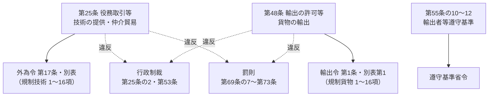

[外国為替及び外国貿易法](https://laws.e-gov.go.jp/law/324AC0000000228)（昭和24年法律第228号。以下「外為法」）は、対外取引全般（支払、資本取引、対内直接投資、貿易）を対象とする法律です。安全保障貿易管理の根拠になるのは、主に**第25条（技術の提供など＝役務取引）**と**第48条（貨物の輸出）**で、これに行政制裁・遵守基準・罰則が組み合わさっています。

> 2026年8月12日施行の外為法（e-Gov）をもとに整理しています。見出しは条文の見出し（見出しのない条は本サイトで補ったもの）、説明は本サイトによる要約です。

## 全体の構造

| 区分 | 条 | 役割 |
|---|---|---|
| 規制の対象 | **第25条**・**第48条** | 技術の提供と貨物の輸出に許可（又は承認）を求める |
| 行政制裁 | 第25条の2・第53条 | 無許可の取引・輸出をした者に、一定期間の輸出・技術提供を禁止する |
| 社内体制 | 第55条の10〜第55条の12 | 輸出者等が守るべき基準（遵守基準）と、指導・勧告・命令 |
| 調査・手続 | 第55条の8、第55条の13、第67条、第68条 | 報告徴収、行政手続法の適用除外、許可の条件、立入検査 |
| 罰則 | 第69条の7〜第73条 | 無許可輸出等の刑事罰、両罰規定（法人への罰金）、過料 |
| 経済制裁の根拠 | 第10条・第16条・第48条第3項 など | 閣議決定に基づく対応措置（北朝鮮・ロシア等への措置） |

## 章の構成

外為法は9つの章（と枝番号の章）からなります。安全保障貿易管理で主に読むのは**第4章（第25条）・第6章（第48条）・第6章の3・第9章**です。

| 章 | 条 | 内容 | 安全保障貿易管理との関係 |
|---|---|---|---|
| 第1章 総則 | 第1条〜第9条 | 目的、適用範囲、定義（居住者・非居住者など） | 「居住者」「非居住者」の定義（第6条） |
| 第2章 我が国の平和及び安全の維持のための措置 | 第10条 | 閣議決定による対応措置 | 経済制裁（輸出入の承認制など）の根拠 |
| 第3章 支払等 | 第16条〜第19条 | 支払の許可、銀行等の確認義務、本人確認 | 資産凍結などの金融制裁 |
| 第4章 資本取引等 | 第20条〜**第25条の2** | 資本取引、対外直接投資、**役務取引** | **技術の提供・仲介貿易の許可（第25条）** |
| 第5章 対内直接投資等 | 第26条〜第30条 | 外国投資家による投資の届出・審査 | 別の制度（投資審査） |
| 第6章 外国貿易 | 第47条〜第54条 | 輸出・輸入 | **貨物の輸出の許可・承認（第48条）**、制裁（第53条） |
| 第6章の2 報告等 | 第55条〜第55条の9 | 支払・取引の報告 | 報告徴収（第55条の8） |
| 第6章の2の2 外国為替取引等取扱業者遵守基準 | 第55条の9の2〜第55条の9の4 | 銀行等が守るべき基準 | ― |
| 第6章の3 輸出者等遵守基準 | 第55条の10〜第55条の12 | 輸出者等が守るべき基準 | **社内の輸出管理体制**（→ [07](../../07-compliance-cp/)） |
| 第7章 行政手続法との関係 | 第55条の13 | 行政手続法の適用除外 | 許可・取消しに行政手続法の審査基準などの規定が適用されない |
| 第7章の2 審査請求 | 第56条 | 審査請求 | ― |
| 第8章 雑則 | 第65条〜第69条の6 | 許可の条件、立入検査、権限の委任 など | 許可の条件（第67条）、立入検査（第68条） |
| 第9章 罰則 | 第69条の7〜第73条 | 刑事罰・過料 | 無許可輸出等の罰則（→ [08](../../08-penalties-cases/)） |

## 安全保障貿易管理に関わる条

| 条 | 見出し | 簡単な説明 | 下位法令 | 関連ページ |
|---|---|---|---|---|
| 第1条 | 目的 | 対外取引は**自由が基本**で、管理・調整は必要最小限とする | ― | ― |
| 第5条 | 適用範囲 | 日本に主たる事務所がある法人の従業者が、**外国で**その法人の業務についてした行為にも適用 | ― | ― |
| **第6条** | 定義 | 第1項第5号「**居住者**」＝日本に住所・居所がある自然人と、日本に主たる事務所がある法人。第6号「**非居住者**」＝それ以外。第2項：区別が明白でないときは財務大臣が定める | （財務省の解釈通達） | [04](../../04-technology-transfer/) |
| 第10条 | （対応措置） | 平和と安全の維持のため特に必要なときは、閣議決定で対応措置（第16条・第48条第3項・第52条などの措置）を講じる | ― | [01](../../01-overview/#0-輸出できる早見マトリクス) |
| **第25条** | 役務取引等 | 技術の提供・特定記録媒体等の輸出・仲介貿易などに許可（→ [下記](#第25条役務取引等の中身)） | 外為令 第17条・第18条・別表、貿易外省令、貨物等省令 | [04](../../04-technology-transfer/) |
| 第25条の2 | 制裁等 | 第25条第1項の無許可取引をした者に、**3年以内**の技術提供・貨物輸出の禁止（第25条第2項・第3項の違反は1年以内、第4項（仲介貿易）の違反は3年以内） | ― | [08](../../08-penalties-cases/) |
| 第47条 | 輸出の原則 | 貨物の輸出は、最少限度の制限の下に許容される | ― | ― |
| **第48条** | 輸出の許可等 | 貨物の輸出に許可・承認（→ [下記](#第48条輸出の許可等の中身)） | 輸出令 第1条・第2条・別表、貨物等省令、輸出規則 | [02](../../02-list-control/)・[03](../../03-catch-all/) |
| 第51条 | 船積の非常差止 | 特に緊急の必要があるとき、1か月以内の期限で品目・仕向地を指定して船積を止められる | ― | ― |
| 第52条 | 輸入の承認 | 輸入の承認（輸入貿易管理令） | ― | ― |
| **第53条** | 制裁 | 第48条第1項の無許可輸出をした者に、**3年以内**の輸出・技術提供の禁止（その他の違反は1年以内）。第3項・第4項で、違反者（個人）や違反した法人の役員・使用人が、同じ業務を行う他の法人の担当役員になることや、その業務を新たに始めることも禁止できる | 輸出令 第9条・第10条 | [08](../../08-penalties-cases/) |
| 第54条 | 税関長に対する指揮監督等 | 輸出入について経済産業大臣が税関長を指揮監督する | 輸出令 第5条 | ― |
| 第55条の8 | その他の報告 | 主務大臣は、取引を行った者などに報告を求められる | 外為令 第18条の8、貿易外省令 第10条 | ― |
| **第55条の10** | 輸出者等遵守基準 | 第25条第1項の取引・第48条第1項の輸出を業として行う者（**輸出者等**）が守る基準を省令で定める。輸出者等は基準に従わなければならない（第4項） | 遵守基準省令 | [07](../../07-compliance-cp/) |
| 第55条の11 | 指導及び助言 | 遵守基準に沿った輸出等が行われるよう指導・助言 | ― | [07](../../07-compliance-cp/) |
| 第55条の12 | 勧告及び命令 | 指導・助言後もなお違反していれば勧告、従わなければ命令（命令違反は第71条の罰則） | ― | [07](../../07-compliance-cp/) |
| 第55条の13 | 行政手続法の適用除外 | 第25条・第48条の許可とその取消しには、行政手続法第2章・第3章を適用しない | ― | ― |
| 第67条 | 許可等の条件 | 許可・承認に条件を付け、変更できる（包括許可の条件などの根拠） | ― | [06](../../06-application/) |
| 第68条 | 立入検査 | 職員が営業所に立ち入り、帳簿書類などを検査し、質問できる | ― | ― |
| 第69条の3 | （関係行政機関の協力） | 経済産業大臣は第25条・第48条の運用について、外務大臣などに資料・意見を求められる | ― | ― |

### 第25条（役務取引等）の中身

| 項 | 何の規制か | 内容 | 政令 |
|---|---|---|---|
| **第1項** | 技術の提供（許可） | 政令で定める**特定技術**を**特定国**で提供する取引、又は特定国の**非居住者**に提供する取引 | 外為令 第17条第1項・**別表**（1〜16項、下欄は「全地域」など） |
| 第2項 | 技術の提供（許可を課すことができる） | 特定国**以外**の外国での提供・その非居住者への提供 | 外為令 第17条第2項（16項の技術をグループAで提供する場合） |
| 第3項 | 記録媒体の輸出・電気通信による送信（許可を課すことができる） | 第1号＝第1項の取引に関する特定記録媒体等の輸出（イ）・電気通信による送信（ロ）、第2号＝第2項の取引に関するもの | 外為令 第17条第3項・第4項 |
| **第4項** | **仲介貿易**（許可） | 居住者が非居住者との間で行う、外国相互間の貨物の移動を伴う売買・貸借・贈与 | 外為令 第17条第5項 |
| 第5項 | 特定の役務取引（許可） | 鉱産物の加工・貯蔵、使用済核燃料の再処理、放射性廃棄物の処理などの役務取引 | 外為令 第18条第1項 |
| 第6項 | その他の役務取引等（許可を課すことができる） | 条約の履行や国際平和への寄与などのため、役務取引・仲介貿易に許可を課す（経済制裁で使われる） | 外為令 第18条第3項〜第5項（告示で指定） |

### 第48条（輸出の許可等）の中身

| 項 | 何の規制か | 内容 | 政令 |
|---|---|---|---|
| **第1項** | 輸出の**許可** | 政令で定める**特定の地域**を仕向地とする**特定の種類の貨物**の輸出 | 輸出令 第1条第1項・**別表第1** |
| 第2項 | 輸出の許可（許可を課すことができる） | 第1項の貨物を、特定の地域**以外**へ輸出する場合 | 輸出令 第1条第3項（16項の貨物をグループAへ輸出する場合） |
| 第3項 | 輸出の**承認** | 国際収支、条約の履行、国際平和への寄与、第10条の閣議決定の実施などのための承認 | 輸出令 第2条・別表第2系（→ [輸出令の構造](../export-order/)） |

{}
安全保障貿易管理（リスト規制・キャッチオール）は第48条**第1項・第2項の「許可」**、北朝鮮・ロシア等への禁止措置などの経済制裁は主に第48条**第3項の「承認」**です。同じ「輸出できない」でも根拠と罰則が違います（→ [01 早見マトリクス](../../01-overview/#0-輸出できる早見マトリクス)）。
{}

## 罰則（第9章）

| 条 | 対象となる違反 | 個人 | 法人（第72条） |
|---|---|---|---|
| **第69条の7 第2項** | 大量破壊兵器等に関係する**技術**（第1号。外為令第27条で指定）・**貨物**（第2号。輸出令第14条で指定）の無許可の提供・輸出・仲介貿易 | **10年**以下の拘禁刑若しくは**3,000万円**以下の罰金（価格の5倍が上回ればその額）、又は併科 | **10億円**以下（価格の5倍が上回ればその額） |
| **第69条の7 第1項** | 第25条第1項・第4項の無許可取引、第48条第1項の無許可輸出 | **7年**以下・**2,000万円**以下（価格の5倍）、又は併科 | **7億円**以下（価格の5倍） |
| 第69条の8 | 第25条第2項・第3項第1号、第48条第2項の無許可、第48条第3項の**無承認輸出**、第52条の無承認輸入 | **5年**以下・**1,000万円**以下（価格の5倍）、又は併科 | **5億円**以下（価格の5倍） |
| 第70条 | 第25条第3項第2号の無許可、第25条の2・第53条の**禁止に違反**した輸出・取引、第67条の**許可の条件**違反、**不正な手段**による許可の取得、第51条の船積差止の違反 など | **3年**以下・**100万円**以下（価格の3倍）、又は併科 | 各本条の罰金（第72条第1項第5号） |
| 第71条 | 第55条の8の報告をしない・虚偽の報告、第55条の12第2項の**命令違反**（遵守基準）、第68条の立入検査の拒否・虚偽の答弁 など | **6か月**以下の拘禁刑又は**50万円**以下の罰金 | 各本条の罰金 |
| 第72条 | **両罰規定**：法人の代表者・従業者が業務に関して違反したとき、行為者のほか法人も罰する | ― | ― |
| 第73条 | 第67条の許可の条件に違反した者（刑を科すべきときを除く） など | 10万円以下の**過料** | ― |

- 第69条の7第3項・第69条の8第2項・第70条第2項で、一部の**未遂**も罰せられます。
- 罰則の詳細と事例は → [08 違反事例](../../08-penalties-cases/)

{}
- **2026年6月5日施行**の改正（令和8年法律第30号）で第69条の5（外国執行当局への情報提供）が追加され、罰則の条番号が一つずつ繰り下がりました（旧第69条の6 → 現第69条の7、旧第69条の7 → 現第69条の8）。それ以前の資料や過去問の条番号は読み替えが必要です。罰則の内容（刑の重さ）は変わっていません。
- **2027年1月4日施行予定**の同じ改正法の残りの部分は、主に対内直接投資（第5章）の改正です。安全保障貿易管理に関わる条の内容は変わりませんが、**第70条の号番号**が繰り下がります（例：第53条の禁止違反は第32号 → 第38号、第67条の条件違反は第35号 → 第41号）。
{}

## 関係する政令・省令

| 外為法 | 政令 | 省令 | 本サイト |
|---|---|---|---|
| 第25条（技術・仲介貿易） | [外為令](../foreign-exchange-order/) 第17条・別表 | 貨物等省令（第15条以降）、貿易外省令 | [04](../../04-technology-transfer/) |
| 第48条（貨物） | [輸出令](../export-order/) 第1条・第2条・別表 | 貨物等省令（第1条〜第14条の2）、輸出規則 | [02](../../02-list-control/)・[03](../../03-catch-all/) |
| 第55条の10（遵守基準） | ― | 遵守基準省令 | [07](../../07-compliance-cp/) |
| 罰則（第69条の7第2項） | 外為令 第27条、輸出令 第14条 | ― | [08](../../08-penalties-cases/) |
| 主務大臣（第69条の2） | 外国為替及び外国貿易法における主務大臣を定める政令 | ― | ― |

{}
- 外為法の条文は「政令で定める」と書くだけで、**何が規制対象かは政令（外為令・輸出令）の別表**を見ないとわかりません。
- 第25条第1項の「特定国」、第48条第1項の「特定の地域」は、別表の**下欄**（全地域、グループA以外 など）で決まります。
- 条・項・号の読み方は → [法令の構造と読み方ガイド](../reading-guide/)
{}
