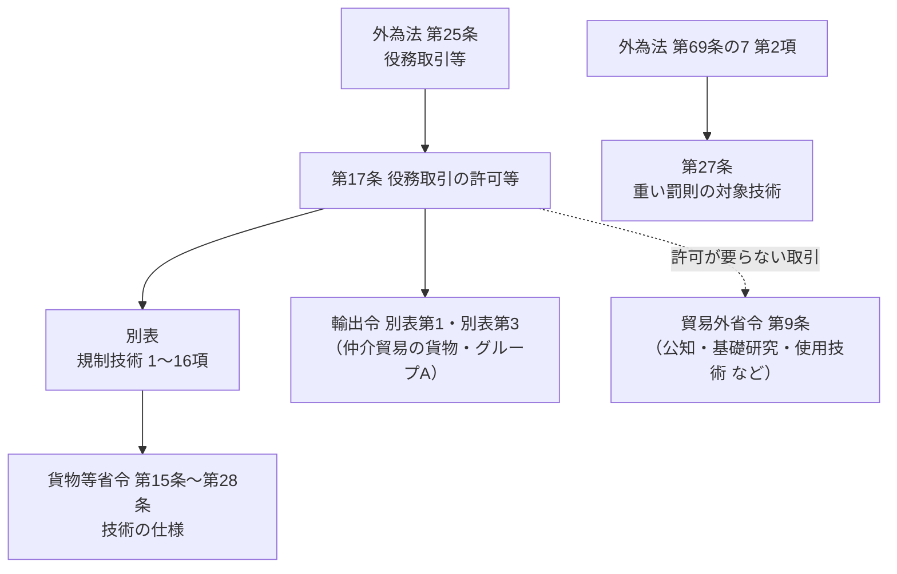

[外国為替令](https://laws.e-gov.go.jp/law/355CO0000000260)（昭和55年政令第260号。以下「外為令」）は、外為法の支払・資本取引・役務取引などについて具体的に定める政令です。安全保障貿易管理で読むのは主に**第17条（役務取引の許可等）と別表（規制技術の1〜16項）**で、外為法第25条の「技術の提供」と「仲介貿易」の対象を決めています。貨物の輸出を定める[輸出令](../export-order/)と対になる政令です。

> 2026年6月5日施行の外為令（e-Gov）をもとに整理しています。見出しは条文の見出し（見出しのない条は本サイトで補ったもの）、説明は本サイトによる要約です。

## 全体の構造

| 区分 | 条・別表 | 役割 |
|---|---|---|
| 規制の対象 | **第17条**・**別表** | 技術の提供、記録媒体の輸出・送信、仲介貿易の**許可** |
| その他の役務取引 | 第18条 | 鉱産物の加工などの役務取引、経済制裁による役務取引の許可 |
| 手続・執行 | 第18条の2、第18条の3、第18条の8 | 税関の確認、役務取引等の禁止、報告 |
| 罰則との関係 | 第27条 | 外為法の重い罰則が適用される技術の範囲 |
| その他 | 第1条〜第16条、第18条の4〜第26条 | 支払、資本取引、対外直接投資、報告、統計、権限の委任（主に金融・投資の規制） |

## 章の構成

外為令には「外国貿易（貨物）」の章がありません。貨物の輸出は輸出令が定めるためです。安全保障貿易管理で読むのは**第4章の第17条〜第18条の3**と、**第5章の第27条**です。

| 章 | 条 | 内容 |
|---|---|---|
| 第1章 総則 | 第1条〜第3条 | 趣旨、定義（支払手段）、取引の非常停止 |
| 第2章 削除 | 第4条・第5条 | ― |
| 第3章 支払等 | 第6条〜第8条の2 | 支払の許可、銀行等の確認・本人確認、支払手段の輸出入 |
| 第4章 資本取引等 | 第9条〜**第18条の3** | 資本取引、対外直接投資、特定資本取引、**役務取引（第17条〜第18条の3）** |
| 第4章の2 報告等 | 第18条の4〜第18条の9 | 支払・資本取引などの報告、**その他の報告（第18条の8）**、統計 |
| 第4章の3 外国為替取引等取扱業者遵守基準 | 第18条の10 | 銀行等の範囲 |
| 第5章 雑則 | 第19条〜**第27条** | 所管の区分、換算、告示の方法、権限の委任、**重い罰則の対象技術（第27条）** |

## 安全保障貿易管理に関わる条

| 条 | 見出し | 簡単な説明 | 外為法 | 関連ページ |
|---|---|---|---|---|
| **第17条** | 役務取引の許可等 | 技術の提供・記録媒体の輸出・仲介貿易の許可（→ [下記](#第17条役務取引の許可等の中身)） | 第25条第1項〜第4項 | [04](../../04-technology-transfer/) |
| 第18条 | （特定の役務取引等の許可） | 第1項：鉱産物の加工・貯蔵、使用済核燃料の再処理、放射性廃棄物の処理の役務取引。第3項〜第5項：経済制裁などで許可を課す役務取引等は**告示で指定**し、不要になれば告示で解除 | 第25条第5項・第6項 | ― |
| 第18条の2 | 税関長の確認等 | 特定技術を記録した文書・記録媒体の輸出時に、税関長が許可の有無を確認する。外為法第25条の2の制裁をしたときは税関長に通知 | 第25条第3項、第25条の2 | ― |
| 第18条の3 | 役務取引等の制限の範囲等 | 第25条第6項の許可を受けずに役務取引等をした者に対する禁止・許可義務の手続 | 第25条の2第4項 | ― |
| 第18条の8 | その他の報告 | 取引を行った者などに報告を求める方法（通知などで事項を指定） | 第55条の8 | ― |
| 第19条 | 財務大臣と経済産業大臣の所管事項の区分 | 所管の区分は外為法と主務大臣政令による（技術の提供・仲介貿易は経済産業大臣） | 第69条の2 | ― |
| 第23条 | 告示の方法 | この政令に基づく告示は官報で行う | ― | ― |
| **第27条** | 核兵器等の開発等に用いられるおそれが特に大きい技術等 | 外為法の**重い罰則**（大量破壊兵器関連）の対象となる技術＝別表の**1〜4項**の技術（輸出令別表第1の1項(5)・(6)・(10)〜(12)の貨物と核兵器等そのものの技術を除く） | 第69条の7第2項第1号 | [08](../../08-penalties-cases/) |

### 第17条（役務取引の許可等）の中身

| 項 | 外為法 | 何の規制か | 内容 |
|---|---|---|---|
| **第1項** | 第25条第1項 | 技術の提供（許可） | 「特定技術を特定国で提供する取引・特定国の非居住者に提供する取引」＝**別表中欄の技術**を、**同表下欄の外国**で提供する取引・その外国の非居住者に提供する取引 |
| 第2項 | 第25条第2項 | 技術の提供（許可） | **16項の技術**を**グループA（輸出令別表第3）**で提供する取引・グループAの非居住者に提供する取引。ただし、実際に許可が必要になるのは、主に**インフォーム**（許可申請をすべき旨の通知）を受けた場合（貿易外省令第9条第2項第7号・第8号） |
| 第3項 | 第25条第3項第1号 | 記録媒体の輸出・電気通信による送信（許可） | 第1項の取引に関して、特定技術を記録した文書・記録媒体（**特定記録媒体等**）を輸出する、又は電気通信で送信する場合（その取引の許可を受けていれば不要） |
| 第4項 | 第25条第3項第2号 | 〃 | 第2項の取引に関するもの |
| **第5項** | 第25条第4項 | **仲介貿易**（許可） | 第1号：**輸出令別表第1の1項（武器）**の貨物の外国相互間の売買・貸借・贈与。第2号：**2〜16項**の貨物で、船積地域・仕向地のどちらもグループAでなく、大量破壊兵器等の開発等に用いられるおそれがある場合（イ：省令で定める要件、ロ：インフォーム） |
| 第6項・第7項 | 第25条第1項・第4項 | 申請手続 | 許可の申請は経済産業省令（貿易外省令）の手続による |
| **第8項** | 第25条第1項・第4項 | 許可が要らない取引 | 経済産業大臣が「特に支障がない」と指定した取引は許可不要＝**貿易外省令第9条第2項**（公知の技術、基礎科学分野の研究、使用に係る技術、工業所有権の出願 など） |

{}
同じ装置でも、**現物を輸出する**ときは輸出令（外為法第48条）、**設計図や製造ノウハウを提供する**ときは外為令（外為法第25条）の許可です。貨物の輸出に付随する使用技術（据付・操作・保守の必要最小限）は、貿易外省令第9条第2項第12号で許可不要になる場合があります（→ [法令の読み方 6.4](../reading-guide/#64-貿易外省令第9条第2項第12号使用技術の例外)）。
{}

## 別表（規制技術）

外為令の別表は、輸出令別表第1と**同じ1〜16項の番号**で、各項の技術を定めています。

| 欄 | 内容 |
|---|---|
| （左端） | 項の番号（一、二、三、三の二、四…一六） |
| 中欄（技術） | 「輸出令別表第一の○の項の中欄に掲げる貨物の**設計、製造又は使用**に係る技術であつて、経済産業省令で定めるもの」が基本形 |
| 下欄（外国） | 1〜15項は「**全地域**」、16項は「全地域（輸出令別表第3に掲げる地域を除く。）」 |

| 項 | 分野 | 中欄の主な内容 | 貨物等省令（主な条） |
|---|---|---|---|
| 1 | 武器 | 輸出令別表第1の1項の貨物の設計・製造・使用に係る技術（**省令への委任なし＝全て**） | ― |
| 2 | 原子力 | (1) 2項の貨物の技術、(2) 数値制御装置の使用に係る技術 | 第15条 |
| 3 | 化学兵器 | (1) 3項(1)の貨物（化学物質）の技術（**省令への委任なし**）、(2) 3項(2)・(3)の貨物（製造設備など）の技術 | 第15条の2（(2)） |
| 3の2 | 生物兵器 | (1) 3の2項(1)の貨物（生物・毒素など）の**設計・製造**の技術（**省令への委任なし**）、(2) 3の2項(2)の貨物（装置）の技術 | 第15条の3（(2)） |
| 4 | ミサイル | (1) 4項の貨物の技術、(2) ロケット用アビオニクスの設計技術、(3) 搭載用電子計算機の使用技術、(4) オートクレーブの使用技術 など | 第16条 |
| 5 | 先端材料 | (1) 5項の貨物の設計・製造、(2) 使用、(3) セラミック、(4) ポリベンゾチアゾール等 など | 第17条 |
| 6 | 材料加工 | (1) 6項の貨物の設計・製造、(2) 使用、(3) 数値制御装置・コーティング装置の使用、(4) 金属加工用の装置・工具 など | 第18条 |
| 7 | エレクトロニクス | (1) 7項の貨物の設計・製造、(2) 7項(16)の貨物の使用、(3) 集積回路の設計・製造、(4) 超電導材料を用いた装置 など | 第19条 |
| 8 | 電子計算機 | (1) 8項の貨物の技術、(2) 電子計算機・附属装置・部分品の技術 | 第20条 |
| 9 | 通信・情報セキュリティ | (1) 9項の貨物の技術、(2) 9項(1)〜(3)・(5)〜(6)の貨物の技術、(3) 通信用マイクロ波集積回路 など | 第21条 |
| 10 | センサー・レーザー | (1) 10項の貨物の設計・製造、(2) 一部の貨物の使用、(3) 光学部品の製造、(4) レーザー発振器の試験装置 など | 第22条 |
| 11 | 航法装置 | (1) 11項の貨物の設計・製造、(2) 使用、(4) アビオニクス装置 など（(3)は削除） | 第23条 |
| 12 | 海洋関連 | (1) 12項の貨物の設計・製造、(2) 使用、(3) プロペラ | 第24条 |
| 13 | 推進装置 | (1) 13項の貨物の設計・製造、(2) 使用、(3) ガスタービンエンジン など | 第25条 |
| 14 | その他 | 14項の貨物の設計・製造・使用に係る技術 | 第26条 |
| 15 | 機微品目 | (1) 15項の貨物の設計・製造、(3) 水中探知装置の使用、(4) 慣性航法装置の使用、(5) 天測航法装置の使用 など（(2)は削除） | 第27条 |
| 16 | キャッチオール | 関税定率法別表の第25〜40類、第54〜59類、第63類、第68〜93類、第95類の貨物の設計・製造・使用に係る技術（1〜15項を除く） | 第28条 |

> 「(1)」は原文では「（一）」です。各項の中身は一部を省略しています。最新の内容は[外為令（e-Gov）](https://laws.e-gov.go.jp/law/355CO0000000260)の別表で確認してください。

{}
- 外為令別表の**項番号は輸出令別表第1と対応**しています。貨物が8項なら、その技術はまず外為令別表の8項を見ます。ただし、技術の項には**貨物の項にない独自の技術**（2項(2)の数値制御装置の使用技術、7項(3)の集積回路の設計・製造技術 など）も入っています。
- 「設計、製造**又は**使用」のどれが対象かは項によって違います（例：5項(1)は設計・製造、(2)は使用）。
- 中欄は「経済産業省令で定めるもの」と書かれています。具体的な技術の範囲は[貨物等省令](https://laws.e-gov.go.jp/law/403M50000400049)の**第15条以降**で決まります。1項、3項(1)、3の2項(1)の技術は省令への委任がなく、対象の貨物の技術が全て規制されます。
- 「技術」「提供」「プログラム」などの用語の解釈は、通達「役務通達」で補われています（→ [関連法令](../)）。
{}
