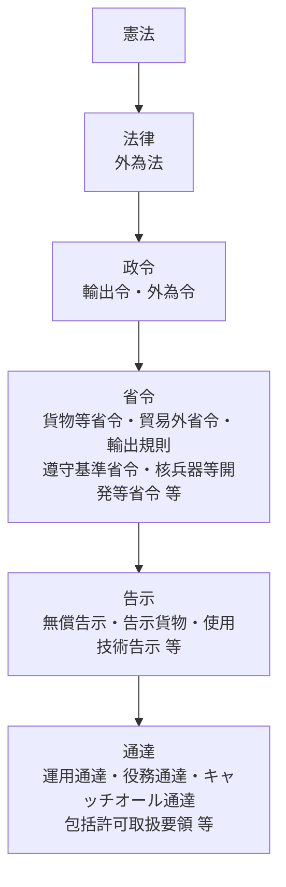
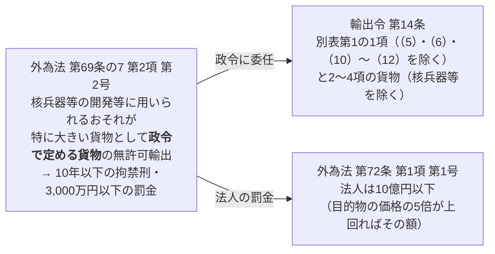

安全保障貿易管理のルールは、外為法を頂点に**政令・省令・告示・通達**が何層にも重なってできています。条文を正しく引くには、①どの階層の規定か、②条文の中のどの単位（条・項・号…）か、③別表や通達に独自の番号の付け方があること、の3つを押さえる必要があります。

> 条文の引用は、2026年10月3日時点の e-Gov 法令検索の条文で確認しています。通達・告示の構成は経済産業省の公表資料によります。

## 1. 法令の階層



上位の規定が優先し、下位の規定は上位の規定の**委任**（「政令で定める」「経済産業省令で定める」「経済産業大臣が告示で定める」）を受けて中身を具体化します。条文に「〜で定めるもの」とあれば、その先の階層を読みに行く合図です。

| 区分 | 誰が定めるか | 例 | 主な役割 |
|---|---|---|---|
| 法律 | 国会 | 外為法 | 許可義務の枠組み（25条＝技術の提供、48条＝貨物の輸出）、行政制裁（25条の2、53条）、罰則（69条の7、72条 など） |
| 政令 | 内閣 | 輸出令、外為令 | 規制対象の**品目の概要と仕向地**（輸出令別表第1、外為令別表）、許可の特例（輸出令第4条）など |
| 省令 | 経済産業大臣 | 貨物等省令、貿易外省令、輸出規則、遵守基準省令、核兵器等開発等省令、通常兵器開発等省令 | 品目の**仕様（しきい値）**、技術提供の許可不要の取引、申請手続、輸出者等の遵守基準、キャッチオールの客観要件 |
| 告示 | 経済産業大臣 | 無償告示、告示貨物（別表第3の3）、使用技術告示、核兵器等開発等告示・通常兵器開発等告示（技術のキャッチオール）、重要管理対象技術の告示 | 法令の委任を受けて、対象の貨物・技術や要件を具体的に指定する |
| 通達 | 経済産業省（行政内部） | 運用通達、役務通達、キャッチオール通達、包括許可取扱要領、申請・相談に関する通達 | 用語の解釈、運用の基準、許可申請の手続、包括許可の条件 |

{}
法律・政令・省令・告示は国民を直接拘束する「法令」です。通達は行政機関の内部で解釈や運用をそろえるための文書ですが、許可の審査は通達に沿って行われるため、実務では法令と同じく必ず確認します。通達は e-Gov には載っていないので、経済産業省の[関係法令・改正情報](https://www.meti.go.jp/policy/anpo/law00.html)で最新版を見ます（→ [関連法令一覧](../)）。
{}

## 2. 条文の単位：条・項・号

法令の本文は、大きい単位から次の順に区切られます。

| 単位 | 表記 | 説明 |
|---|---|---|
| 編・章・節 | 第○章 など | 条文が多い法令をまとめる見出し（外為法は「第6章 外国貿易」など） |
| **条** | 第二十五条 | 法令の基本単位。見出し（「（輸出の許可等）」など）が付くことが多い |
| **項** | ２、３… | 条の中の段落。**第1項には番号が付かない**。第2項以降は「２」「３」と算用数字 |
| **号** | 一、二、三… | 項（又は条）の中で事柄を列挙する単位。漢数字 |
| 号の細分 | イ、ロ、ハ… | 号をさらに分ける。**イロハ順**（アイウ順ではない） |
| さらに細分 | （一）、（二）… → １、２… | イ・ロ・ハをさらに分ける |

- **第1項の数字**：原文には「１」がありませんが、引用するときは必ず「第○条**第1項**」と呼びます（項が一つしかない条でも同じ）。
- **柱書（はしらがき）**：号を列挙する前の本文（「次に掲げる場合には、適用しない。」など）。号の読み方を決める部分なので、号だけを抜き出して読まないようにします。
- **ただし書**：本文の後の「ただし、〜」。例外や除外を定めます。

ネストの見え方（貨物等省令第7条の例。条文を省略して構造だけ示す）：

```text
第七条  輸出令別表第一の八の項の経済産業省令で定める仕様のものは、次のいずれかに該当するものとする。  ← 第1項（番号なし）・柱書
  一  電子計算機若しくはその附属装置であって、次のいずれかに該当するもの…                     ← 第一号
    イ  八五度を超える温度又は零下四五度より低い温度で使用することができるように設計したもの   ← 号の細分
    ロ  放射線による影響を防止するように設計したものであって、次のいずれかに該当するもの
      （一）全吸収線量がシリコン換算で五、〇〇〇グレイを超える…                              ← さらに細分
      （二）…
  二  削除
  三  デジタル電子計算機…
```

この「ロ（一）」は「貨物等省令**第7条第1号ロ（一）**」と引用します（第1項しかないので「第1項」は省略されることが多い）。

## 3. 枝番号と「削除」

改正で条文を途中に足すときは、後ろの番号を繰り下げず**枝番号**を付けます。

| 単位 | 例 | 意味 |
|---|---|---|
| 条 | 外為法 **第25条の2**（制裁等） | 第25条と第26条の間に追加された、独立した一つの条 |
| 号 | 輸出令第2条第1項 **第1号の2**〜**第1号の8** | 北朝鮮・ロシア等への措置として、第1号と第2号の間に追加された号 |
| 号の細分 | 別表第1の3の2の項(2) **5の2**（噴霧乾燥器） | 5と6の間に追加された品目 |

- **項には枝番号を付けません**。項を足すときは、後ろの項を繰り下げます（そのため改正前後で項番号がずれることがあります）。
- 規定を廃止しても番号を詰めず「**削除**」として残すことがあります（輸出令第3条・第6条、貨物等省令第7条第2号 など）。番号が飛んでいても読み落としではありません。
- 「第25条の2」は第25条の一部ではありません。「第25条の2第1項」のように、それ自体が条として項・号を持ちます。

## 4. 別表（リスト規制）の読み方

輸出令別表第1と外為令別表は、リスト規制の中心となる表です。

### 項と欄

| 欄 | 内容 | 別表第1の例 |
|---|---|---|
| （左端） | 項の番号 | 一、二、三、三の二、四…一六 |
| **中欄** | 貨物（外為令別表では技術） | 「（二）次に掲げる貨物であつて、…経済産業省令で定める仕様のもの」 |
| **下欄** | 仕向地 | 1〜15項は「全地域」、16項は別表第3（グループA）を除く全地域 |

- **1〜15項**はリスト規制（1項＝武器、2〜15項＝汎用品）、**16項**はキャッチオール規制です（→ [02 リスト規制](../../02-list-control/)・[03 キャッチオール](../../03-catch-all/)）。
- 項にも枝番号があります。**3の2の項**は3の項と4の項の間に追加された独立した項で、生物兵器関連の貨物を定めます（3の項は化学兵器関連）。

### 項の中の番号と引用の仕方

項の中は「（一）、（二）…」、その下は「１、２…」と分かれます。例：

```text
別表第一  三の二の項
  （二）次に掲げる貨物であつて、軍用の細菌製剤の開発、製造若しくは散布に用いられる装置又はその部分品であるもののうち経済産業省令で定める仕様のもの
        １ 物理的封じ込めに用いられる装置
        ２ 発酵槽又はその部分品
        ３ 遠心分離機
        …
        ５ 凍結乾燥器
        ５の２ 噴霧乾燥器
```

| 書き方 | 読み方 |
|---|---|
| 正式な引用 | 輸出令別表第1の**3の2の項（2）3** |
| 実務の略記 | 「3の2(2)3」「3の2項(2)3」 |
| 意味 | 生物兵器関連（3の2の項）→ 製造等に用いる装置（（2））→ 遠心分離機（3） |

### 政令から省令へ：仕様は省令で決まる

別表第1の中欄には品目の概要しかなく、「**経済産業省令で定める仕様のもの**」として、しきい値は貨物等省令に委任されています。たとえば8項（電子計算機）は、貨物等省令**第7条**が「輸出令別表第一の八の項の経済産業省令で定める仕様のもの」を定めています。該非判定では、**別表第1の項 → 貨物等省令の対応する条・号**の順にたどります。技術（外為令別表）の仕様も、同じ貨物等省令の**第15条以降**で定められています（例：外為令別表の8の項（1）→ 第20条）。

## 5. 通達・告示の番号の付け方

通達は法令とは違い、算用数字と記号で階層を作るのが一般的です。

```text
1        大項目
(1)      中項目
イ／ア    小項目（通達によってイロハ順とアイウ順がある）
```

| 引用例 | 読み方 |
|---|---|
| 役務通達 **1（3）サ** | 役務通達の1（大項目）→（3）（用語の解釈）→ サ（「特定類型」の定義） |
| 役務通達 **別紙1-3** | 本文とは別の添付資料（特定類型の該当性の判断に関するガイドライン） |
| 包括許可取扱要領 **別表A** | 要領に付いた表（貨物包括マトリクス） |

通達の「別表」「別紙」は、政令の別表とは別物です。どの文書の別表かを必ず書き添えて引用します。

### よく使う通達・告示

| 略称 | 正式名称 / 根拠 | 主な内容 |
|---|---|---|
| 運用通達 | 輸出貿易管理令の運用について | 輸出令の用語の解釈、部分品・附属品の扱い、特例の運用 |
| 役務通達 | 外国為替及び外国貿易法第25条第1項及び外国為替令第17条第2項の規定に基づき許可を要する技術を提供する取引又は行為について | 「技術」「提供」などの解釈、居住者・非居住者、特定類型（1（3）サ、別紙1-3・1-4） |
| キャッチオール通達 | 大量破壊兵器等及び通常兵器に係る補完的輸出規制に関する輸出手続等について | 用途・需要者の確認、明らかガイドライン、事前相談 |
| 包括許可取扱要領 | 包括許可取扱要領 | 包括許可の種類・要件・条件、別表A/B（包括マトリクス） |
| 無償告示 | 輸出令第4条第1項第2号ホ・ヘの告示 | 無償特例の対象となる貨物 |
| 使用技術告示 | 貿易外省令第9条第2項第12号〜第14号の「経済産業大臣が告示で定めるもの」 | 貨物・プログラムに付随する使用技術の例外を**使えない**技術・プログラム |

## 6. 条文の読み解き例

### 6.1 外為法第25条第1項・第48条第1項（許可の根拠）

| 条文 | 要旨 |
|---|---|
| **外為法第25条第1項** | 政令で定める特定の種類の貨物の設計・製造・使用に係る技術（**特定技術**）を、特定国で提供し、又は特定国の非居住者に提供する取引には、経済産業大臣の**許可**が必要 |
| **外為法第48条第1項** | 政令で定める特定の地域を仕向地とする特定の種類の貨物の**輸出**には、経済産業大臣の許可が必要 |

どちらも「政令で定める」ので、対象の技術は外為令別表、貨物は輸出令別表第1で決まります（→ [01 全体像](../../01-overview/)）。

### 6.2 輸出令第4条第1項第1号イ（特例の除外）

```text
第四条  法第四十八条第一項の規定は、次に掲げる場合には、適用しない。
        ただし、別表第一の一の項の中欄に掲げる貨物（第二号ホ及びへに掲げる貨物を除く。）については、この限りでない。
  一  仮に陸揚げした貨物のうち、本邦以外の地域を仕向地とする船荷証券…により運送されたもの（…「外国向け仮陸揚げ貨物」という。）を輸出しようとするとき
      （別表第三に掲げる地域以外の地域を仕向地として輸出しようとする場合にあつては、次に掲げるいずれの場合にも該当しないときに限る。）。
    イ  その貨物が核兵器…（…「核兵器等」という。）の開発、製造、使用又は貯蔵（…「開発等」という。）のために用いられるおそれがある場合として経済産業省令で定めるとき。
    ロ  その貨物が核兵器等の開発等のために用いられるおそれがあるものとして経済産業大臣から許可の申請をすべき旨の通知を受けたとき。
```

| 部分 | 読み方 |
|---|---|
| 第1項 柱書 | 次の場合は48条1項の**許可が要らない** |
| ただし書 | ただし**1項（武器）の貨物は特例を使えない**（無償特例の第2号ホ・ヘを除く） |
| 第1号 | 外国向け仮陸揚げ貨物は許可不要。ただし**グループA以外**が仕向地なら、イ・ロのどちらにも当たらない場合に限る |
| 第1号**イ** | 大量破壊兵器等の開発等に用いられるおそれがある場合（具体的には核兵器等開発等省令で定める） |
| 第1号**ロ** | 経済産業大臣から許可申請をすべき旨の通知（インフォーム）を受けた場合 |

「第4条第1項第1号イ」は、**仮陸揚げ特例が使えなくなる条件の一つ**を指します。号の中のかっこ書と、柱書のただし書を合わせて読まないと、適用範囲を誤ります。

### 6.3 貨物等省令第7条第3号・第4号（仕様と除外）

8項（電子計算機）の仕様を定める条文で、号の中に「該当するもの」と「除くもの」が同居する典型例です。

| 号 | 内容 | 読み方 |
|---|---|---|
| 第3号 柱書 | デジタル電子計算機などであって、**ロ、ハ若しくはト**のいずれかに該当するもの（**チからヌまで**のいずれかに該当するものを除く。） | 該当要件はロ・ハ・ト、除外はチ〜ヌ。イ・ニ・ホ・ヘは「削除」 |
| 第3号 ロ | 加重最高性能が70実効テラ演算を超えるデジタル電子計算機 | 該当要件 |
| 第3号 チ・リ | 他の装置に内蔵され、その装置の稼働に不可欠なもののうち、主要な要素でないもの／機能が信号処理・画像強調に限られるもの | 除外 |
| 第4号 イ〜ハ | シストリックアレイコンピュータ、ニューラルコンピュータ、光コンピュータ（その附属装置・電子組立品・部分品を含む） | 号の中で細分された該当品目 |

イ〜ヌが同じ並びにあっても、柱書が「該当」と「除外」に振り分けています。**柱書を読まずにイ・ロ…だけを見ると、除外規定を規制要件と取り違えます。**

### 6.4 貿易外省令第9条第2項第12号（使用技術の例外）

第9条第2項は、外為令第17条第8項の「経済産業大臣が指定する取引」＝**役務取引の許可が要らない取引**を列挙しています。その第12号：

| 部分 | 内容 |
|---|---|
| 本文 | 貨物の輸出に付随して提供する使用に係る技術（**プログラムと告示で定めるものを除く**）で、据付・操作・保守・修理のための**必要最小限**のものを、買主・荷受人・需要者に提供する取引。輸出許可の日又は輸出契約の発効日の**いずれか遅い日以降**に提供するものに限る |
| ただし書 | 保守・修理の技術のうち、次に当たるものは**例外を使えない** |
| イ | 貨物の性能・特性が当初より向上するもの |
| ロ | 修理技術で、内容が貨物の設計・製造技術と同等のもの |
| ハ | 外為令別表中欄の技術で、貨物の設計・製造に必要な技術を含むもの |

本文のかっこ書の「告示で定めるもの」が**使用技術告示**です。この号は、本文（例外）→ かっこ書（除外）→ ただし書（さらに除外）の三段で読みます（→ [05 例外](../../05-exceptions/)）。

### 6.5 外為法第69条の7第2項第2号と輸出令第14条（法律と政令の相互参照）



| 条文 | 内容 |
|---|---|
| 外為法 第69条の7 第1項 | 無許可の役務取引・輸出の基本の罰則（7年以下の拘禁刑若しくは2,000万円以下の罰金。目的物の価格の5倍が2,000万円を超えるときは5倍以下） |
| 外為法 第69条の7 **第2項** | 大量破壊兵器等に関係する技術（第1号）・貨物（第2号）は**重い罰則**（10年以下・3,000万円以下。価格の5倍が上回ればその額） |
| 輸出令 第14条 | 第2項第2号の「政令で定める貨物」を、別表第1の項番で指定 |
| 外為法 第72条 | 両罰規定。法人にも罰金（第69条の7第2項の違反は10億円以下、第1項は7億円以下） |

法律が「どの貨物が特に危険か」の決定を政令に委ね、政令が別表第1の**項番**で指定する構造です。輸出令第14条の「（5）、（6）及び（10）から（12）まで」は**1の項の中の番号**なので、「別表第1の1の項（5）」のように読みます（→ [08 罰則](../../08-penalties-cases/)）。

{}
- どの法令の、どの階層か（法律／政令／省令／告示／通達）
- 柱書・ただし書・かっこ書まで読んだか（号だけを抜き出していないか）
- 「〜で定める」の委任先（省令・告示）まで追ったか
- 引用した番号が条・項・号・別表の項のどれか（「第1号」と「1の項」を混同していないか）
- 最新の改正を反映した条文か（e-Gov は現行条文、改正予定は[経済産業省の改正情報](https://www.meti.go.jp/policy/anpo/law09-2.html)）
{}
